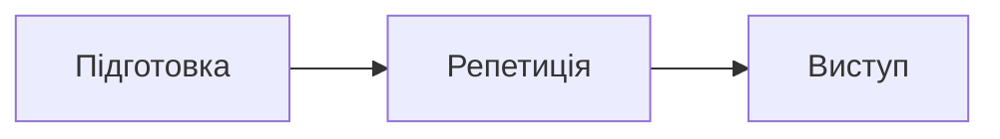

# Concert — Backing Tracks

Українська покрокова документація для підготовки та сценічного відтворення backing tracks у **MainStage 4.3** після експорту з **Logic Pro 12.3**.

## Вебверсія

Після першого успішного запуску GitHub Actions документація буде доступна за адресою:

<https://andmev.github.io/Concert/>

## Локальний перегляд

```bash
python3 -m venv .venv
source .venv/bin/activate
pip install -r requirements.txt
mkdocs serve
```

Відкрийте адресу, яку покаже MkDocs (типово `http://127.0.0.1:8000`).

## Публікація

Кожен push у гілку `main` запускає workflow [Deploy documentation to GitHub Pages](.github/workflows/deploy-pages.yml). Він перевіряє збирання документації та публікує її в GitHub Pages.

## Mermaid-діаграми

Mermaid підтримується у всіх Markdown-файлах `docs/`. Додайте діаграму в fenced-блоці з мовою `mermaid`:

````markdown

````

## Межі документації

Поточний пріоритет — базова stereo-конфігурація: один готовий backing track на пісню. Stems, click, індивідуальний мікс і Stage Traxx 4 належать до наступних окремих фаз.
