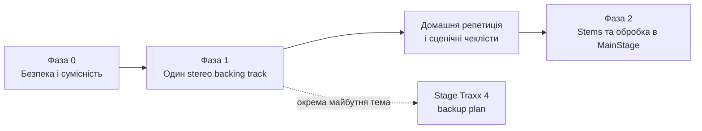

# Карта майбутньої документації

Це план файлів, які потрібно створювати послідовно. Кожен файл починається блоком `Пов’язані документи` й не дублює зміст інших файлів.



## Фаза 0 — передумови та перевірки { #phase-0 }

1. `03-glossary.md` — дуже короткий словник: backing track, stereo/mono, stem, patch, set, concert, channel strip, bus, gain, latency, FOH.
2. `04-compatibility-register.md` — версії, дата тесту й результати для кожної програми/пристрою; зокрема CQ-12T + macOS Tahoe.
3. `05-audio-safety-and-power.md` — безпечна послідовність увімкнення, вимкнення й зміни кабелів; лише з офіційними джерелами.
4. `06-cables-and-stage-checklists.md` — окремі таблиці для Bose S1 Pro+, малого майданчика із Zoom, великої сцени з CQ-12T і FOH.

## Фаза 1 — базова система { #phase-1 }

5. `10-logic-preflight.md` — що перевірити в готовому проєкті Logic, як виключити живу акустичну гітару й основний вокал, як вести картку пісні.
6. `11-logic-export-stereo-backing-track.md` — експорт одного stereo-файлу на пісню; іменування, папки, перевірка файлу.
7. `12-song-structure-sheet.md` — шаблон картки структури: секції, темп, marker/loop-рішення, дозвіл на повтор приспіву, особлива темпова пісня.
8. `13-mainstage-concert-foundation.md` — audio device, базовий `Concert`, один `Set`/`Patch` на пісню, вихід stereo backing track.
9. `14-mainstage-playback-options.md` — порівняння варіантів для автоматичної пісні й повтору приспіву, документальне обґрунтування вибору та rehearsal test.
10. `15-mainstage-song-template.md` — обраний повторюваний шаблон однієї пісні; тест на 10 піснях, потім масштабування до 25.
11. `16-airstep-lite-mapping.md` — Bluetooth MIDI, MIDI Learn, п’ять кнопок, перехід між піснями, повтор приспіву, тест reconnect.
12. `17-cq12t-mainstage-and-foh.md` — MacBook по USB, гітара й SM58 через TC-Helicon, stereo mix у CQ-12T, сценарії Bose/FOH.
13. `18-zoom-ams24-small-stage.md` — MacBook по USB, TC-Helicon, mono/stereo вихід до обладнання майданчика.
14. `19-home-rehearsal.md` — відтворення всього сету, рівні, Bluetooth, переходи, аварійна зупинка, журнал тестів.
15. `20-show-day-checklists.md` — підготовка вдома, завантаження, підключення, soundcheck, виступ, згортання.
16. `21-troubleshooting.md` — немає звуку, mono/stereo помилки, MIDI не приходить, USB-пристрій не з’являється, рівень/кліпінг, відновлення після Bluetooth disconnect.

## Фаза 2 — розширена система

17. `30-stems-and-cq12t-mixing.md` — експорт і програвання stems, routing до CQ-12T, індивідуальний контроль; починається лише після успішної Фази 1.
18. `31-mainstage-live-vocal-and-guitar.md` — перенесення обробки гітари й вокалу у MainStage з окремим планом rollback до TC-Helicon.

## Окрема майбутня тема

19. `40-stage-traxx-4-backup-plan.md` — резервна система Stage Traxx 4. Не створювати як частину базової фази.

## Обов’язковий формат кожного практичного файла

```text
# Назва

## Мета
## Коли застосовувати / коли не застосовувати
## Пов’язані документи
## Передумови
## Офіційні джерела
## Кроки
## Очікуваний результат
## Як перевірити
## Типові помилки та безпечне відновлення
## Практика інших виконавців (за потреби, не як технічне джерело)
## Журнал змін
```
