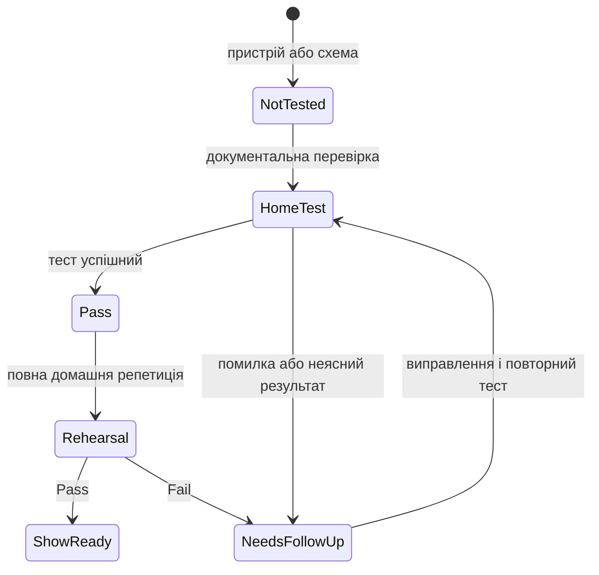

# Реєстр сумісності та домашніх тестів

Цей файл є журналом фактів, а не припущень. Записуй дату, версії, конкретну схему, результат і посилання на джерело.



| Компоненти | Поточний статус | Що потрібно зробити перед концертом | Офіційна основа |
| --- | --- | --- | --- |
| MainStage 4.3 + macOS Tahoe 26.5.2 | MainStage бачить CQ-12T, але вибір пристрою зупиняється на помилці `Sample Rate 48 kHz not allowed` (2026-07-26) | Звірити фактичні частоти CQ-12T, MainStage і macOS; лише потім узгодити їх і повторити короткий playback test | [Apple MainStage Support](https://support.apple.com/mainstage) |
| Logic Pro 12.3 + macOS Tahoe 26.5.2 | Встановлено | На тестовій пісні підтвердити експорт потрібного stereo backing track | [Apple Logic Pro User Guide](https://support.apple.com/guide/logicpro/welcome/mac) |
| CQ-12T + macOS Tahoe 26.5.2 по USB | **Не підтверджено виробником на момент фіксації.** Пристрій виявляється MainStage; є незавершена помилка sample rate (2026-07-26) | Прочитати `CONFIG > Digital Audio > USB/SD > Sample Rate` на CQ-12T. Після узгодження частот зробити короткий і тривалий домашній playback test | [CQ-12T Resources](https://www.allen-heath.com/hardware/cq/cq-12t/resources/) · [CQ: USB/SD sample rate](https://support.allen-heath.com/hc/en-gb/articles/19853352600337-CQ-Multitrack-Recording-and-Playback-from-SD-Card) |
| Zoom AMS-24 + MacBook по USB | Потрібен фактичний тест | Підключити, перевірити Inputs 1/2, `OUTPUT A L/R`, levels і playback у MainStage | [Zoom AMS-24 Operation Manual](https://zoomcorp.com/manuals/ams-24-en/) |
| AIRSTEP Lite + MacBook по Bluetooth | MacBook бачить педаль; MIDI у MainStage ще не зафіксовано | Перевірити MIDI Learn кожної з 5 кнопок, reconnect, 2-годинну репетицію | Офіційний Xsonic manual має бути знайдений перед процедурою |
| TC-Helicon + CQ-12T / Zoom AMS-24 | Бажаний routing підтверджений користувачем; параметри не перевірені | Звірити з повним офіційним manual і протестувати levels без кліпінгу | [Quick Start Guide](https://mediadl.musictribe.com/media/PLM/data/docs/P0CMT/VOICETONE%20HARMONY-G%20XT_QSG_EN.pdf) |
| Одна Bose S1 Pro+ | Погоджений mono-режим для малих сцен | Перевірити, що сигнал не втрачає правий/лівий канал і що рівні безпечні | [Bose Owner’s Guide](https://assets.bose.com/content/dam/Bose_DAM/Web/consumer_electronics/global/products/speakers/S1PROP-SPEAKERWIRELESS/pdf/872237_og_bose-s1-pro_plus_en.pdf) |

## Шаблон результату тесту { #test-result-template }

```text
Дата:
Компоненти та версії:
Схема підключення:
Файл/пісня для тесту:
Тривалість тесту:
Що перевірено:
Результат: Pass / Fail / Needs follow-up
Симптом або примітка:
Наступна дія:
```

## Фактичні результати

### 2026-07-26 — перше підключення CQ-12T до MainStage

| Поле | Значення |
| --- | --- |
| Mac / ПЗ | MacBook Pro M3 Pro; macOS Tahoe 26.5.2; MainStage 4.3 |
| Схема | MacBook → USB → CQ-12T |
| Що підтверджено | CQ-12T з’являється у списку audio devices MainStage |
| Результат | `Needs follow-up` |
| Точний симптом | Після вибору CQ-12T MainStage показує: `Sample Rate 48 kHz not allowed.` |
| Безпечна наступна дія | Лише зчитати три значення: `Sample Rate` у CQ-12T, у MainStage та в `Audio MIDI Setup` для CQ-12T. Не міняти кілька параметрів навмання. |

Це **ще не** підтвердження готовності CQ-12T до виступу: Allen & Heath на сторінці Resources поки не верифікував його повну роботу з macOS Tahoe 26.
