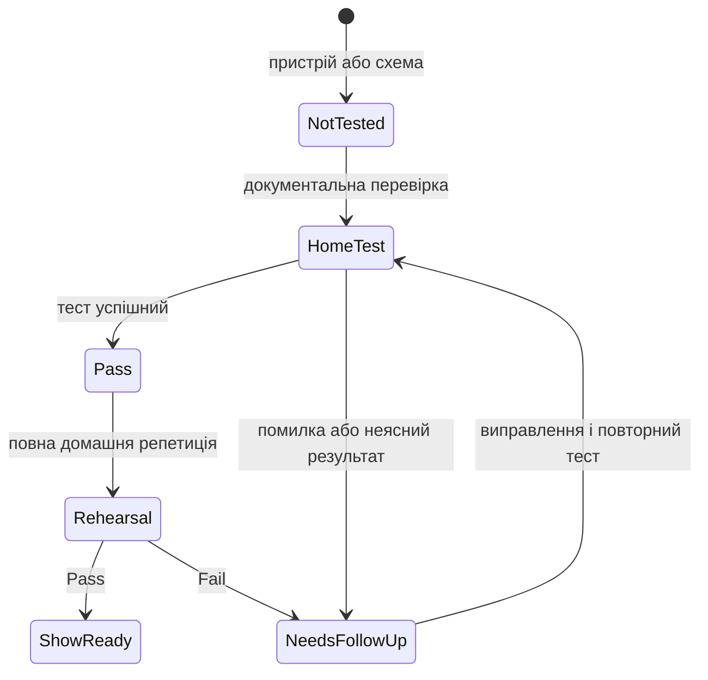

# Реєстр сумісності та домашніх тестів

Цей файл є журналом фактів, а не припущень. Записуй дату, версії, конкретну схему, результат і посилання на джерело.



| Компоненти | Поточний статус | Що потрібно зробити перед концертом | Офіційна основа |
| --- | --- | --- | --- |
| MainStage 4.3 + macOS Tahoe 26.5.2 | MainStage бачить CQ-12T; у MainStage вказано `96 kHz`, але під час попереднього вибору пристрою була помилка `Sample Rate 48 kHz not allowed` (2026-07-26) | Лише зчитати `Format` CQ-12T у macOS `Audio MIDI Setup`; якщо там теж 96 kHz — не змінювати частоту, а перейти до окремої діагностики | [Apple MainStage Support](https://support.apple.com/mainstage) |
| Logic Pro 12.3 + macOS Tahoe 26.5.2 | Встановлено | На тестовій пісні підтвердити експорт потрібного stereo backing track | [Apple Logic Pro User Guide](https://support.apple.com/guide/logicpro/welcome/mac) |
| CQ-12T + macOS Tahoe 26.5.2 по USB | **Не підтверджено виробником на момент фіксації.** Пристрій виявляється MainStage; у самому CQ встановлено `96 kHz` (2026-07-26) | Перевірити `Format` CQ у `Audio MIDI Setup`. Лише після цього зробити короткий і тривалий домашній playback test | [CQ-12T Resources](https://www.allen-heath.com/hardware/cq/cq-12t/resources/) · [CQ: USB/SD sample rate](https://support.allen-heath.com/hc/en-gb/articles/19853352600337-CQ-Multitrack-Recording-and-Playback-from-SD-Card) |
| Zoom AMS-24 + MacBook по USB | Потрібен фактичний тест | Підключити, перевірити Inputs 1/2, `OUTPUT A L/R`, levels і playback у MainStage | [Zoom AMS-24 Operation Manual](https://zoomcorp.com/manuals/ams-24-en/) |
| AIRSTEP Lite + MacBook по Bluetooth | MacBook бачить педаль; MIDI у MainStage ще не зафіксовано | Перевірити MIDI Learn кожної з 5 кнопок, reconnect, 2-годинну репетицію | Офіційний Xsonic manual має бути знайдений перед процедурою |
| TC-Helicon + CQ-12T / Zoom AMS-24 | Бажаний routing підтверджений користувачем; параметри не перевірені | Звірити з повним офіційним manual і протестувати levels без кліпінгу | [Quick Start Guide](https://mediadl.musictribe.com/media/PLM/data/docs/P0CMT/VOICETONE%20HARMONY-G%20XT_QSG_EN.pdf) |
| Одна Bose S1 Pro+ | Погоджений mono-режим для малих сцен | Перевірити, що сигнал не втрачає правий/лівий канал і що рівні безпечні | [Bose Owner’s Guide](https://assets.bose.com/content/dam/Bose_DAM/Web/consumer_electronics/global/products/speakers/S1PROP-SPEAKERWIRELESS/pdf/872237_og_bose-s1-pro_plus_en.pdf) |

## Шаблон результату тесту { #test-result-template }

```text
Дата:
Компоненти та версії:
Схема підключення:
Файл/пісня для тесту:
Тривалість тесту:
Що перевірено:
Результат: Pass / Fail / Needs follow-up
Симптом або примітка:
Наступна дія:
```

## Фактичні результати

### 2026-07-26 — перше підключення CQ-12T до MainStage

| Поле | Значення |
| --- | --- |
| Mac / ПЗ | MacBook Pro M3 Pro; macOS Tahoe 26.5.2; MainStage 4.3 |
| Схема | MacBook → USB → CQ-12T |
| Що підтверджено | CQ-12T з’являється у списку audio devices MainStage |
| Результат | `Needs follow-up` |
| Точний симптом | Після вибору CQ-12T MainStage показує: `Sample Rate 48 kHz not allowed.` |
| CQ-12T `Sample Rate` | `96 kHz`; фактичний шлях на пристрої: `CONFIG > піктограма USB, SD і Bluetooth > USB/SD > Sample Rate` |
| MainStage `Sample Rate` | `96 kHz` |
| Безпечна наступна дія | Лише зчитати `Format` CQ-12T у `Audio MIDI Setup`. Не міняти кілька параметрів навмання. |

Це **ще не** підтвердження готовності CQ-12T до виступу: Allen & Heath на сторінці Resources поки не верифікував його повну роботу з macOS Tahoe 26.

### Як знайти `Audio MIDI Setup` і прочитати `Format` CQ-12T

**Мета:** дізнатися, яку частоту macOS фактично використовує для CQ-12T. На цих кроках нічого не змінюється.

1. Залиш CQ-12T увімкненим і підключеним до MacBook тим самим USB-кабелем.
2. На MacBook натисни `Command + Space`. У центрі екрана з’явиться поле `Spotlight Search`.
3. Надрукуй точно: `Audio MIDI Setup`.
4. Коли в результатах з’явиться програма `Audio MIDI Setup`, натисни `Return`.
5. Відкриється невелике вікно. У його лівій бічній панелі знайди назву `CQ-12T` і натисни її **один раз**.
6. Праворуч знайди поле або меню `Format`. Не натискай його, а просто прочитай повний напис: він має містити частоту на кшталт `96,000 Hz` або `48,000 Hz` і бітову глибину.
7. Якщо праворуч є вкладки `Output` і `Input`, по черзі натисни кожну та запиши значення `Format` для обох. Це лише перегляд.
8. Надішли мені точний текст із поля `Format` для `Output` і, якщо показано, для `Input`. Потім просто закрий вікно червоною кнопкою у верхньому лівому куті.

Apple описує той самий принцип: вибрати пристрій у бічній панелі `Audio MIDI Setup`, а `Format` показує і дає змогу задати sample rate та bit depth; значення мають відповідати налаштуванням пристрою. [Apple: Set up audio devices in Audio MIDI Setup](https://support.apple.com/guide/audio-midi-setup/set-up-audio-devices-ams59f301fda/mac)
