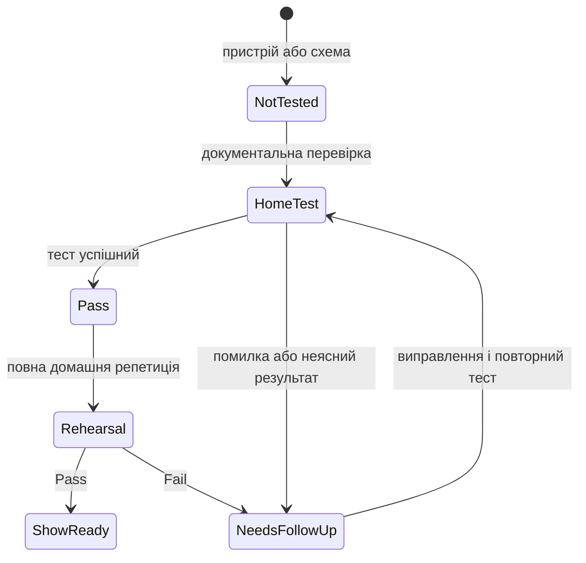

# Реєстр сумісності та домашніх тестів

Цей файл є журналом фактів, а не припущень. Записуй дату, версії, конкретну схему, результат і посилання на джерело.



| Компоненти | Поточний статус | Що потрібно зробити перед концертом | Офіційна основа |
| --- | --- | --- | --- |
| MainStage 4.3 + macOS Tahoe 26.5.2 | Встановлено; робота з цим MacBook ще не зафіксована тестом | Створити тестовий Concert, відтворити WAV/AIFF, перезапустити програму, перевірити audio device | [Apple MainStage Support](https://support.apple.com/mainstage) |
| Logic Pro 12.3 + macOS Tahoe 26.5.2 | Встановлено | На тестовій пісні підтвердити експорт потрібного stereo backing track | [Apple Logic Pro User Guide](https://support.apple.com/guide/logicpro/welcome/mac) |
| CQ-12T + macOS Tahoe 26.5.2 по USB | **Не підтверджено виробником на момент фіксації** | Перевірити актуальний статус на сторінці Resources; якщо він не змінився — зробити тривалий домашній playback test перед репетицією | [CQ-12T Resources](https://www.allen-heath.com/hardware/cq/cq-12t/resources/) |
| Zoom AMS-24 + MacBook по USB | Потрібен фактичний тест | Підключити, перевірити Inputs 1/2, Output A/B, levels і playback у MainStage | [Zoom AMS-24 Operation Manual](https://zoomcorp.com/manuals/ams-24-en/) |
| AIRSTEP Lite + MacBook по Bluetooth | MacBook бачить педаль; MIDI у MainStage ще не зафіксовано | Перевірити MIDI Learn кожної з 5 кнопок, reconnect, 2-годинну репетицію | Офіційний Xsonic manual має бути знайдений перед процедурою |
| TC-Helicon + CQ-12T / Zoom AMS-24 | Бажаний routing підтверджений користувачем; параметри не перевірені | Звірити з повним офіційним manual і протестувати levels без кліпінгу | [Quick Start Guide](https://mediadl.musictribe.com/media/PLM/data/docs/P0CMT/VOICETONE%20HARMONY-G%20XT_QSG_EN.pdf) |
| Одна Bose S1 Pro+ | Погоджений mono-режим для малих сцен | Перевірити, що сигнал не втрачає правий/лівий канал і що рівні безпечні | [Bose Owner’s Guide](https://assets.bose.com/content/dam/Bose_DAM/Web/consumer_electronics/global/products/speakers/S1PROP-SPEAKERWIRELESS/pdf/872237_og_bose-s1-pro_plus_en.pdf) |

## Шаблон результату тесту { #test-result-template }

```text
Дата:
Компоненти та версії:
Схема підключення:
Файл/пісня для тесту:
Тривалість тесту:
Що перевірено:
Результат: Pass / Fail / Needs follow-up
Симптом або примітка:
Наступна дія:
```
