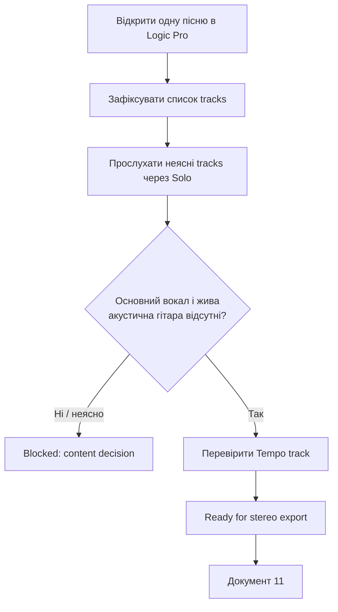

# Logic Pro: перевірка пісні перед експортом backing track

## Мета

Перевірити **один** завершений проєкт Logic Pro перед експортом першого stereo backing track. На цьому етапі ми нічого не експортуємо, не редагуємо аранжування, не міняємо гучності та не створюємо stems. Результат — чітка відповідь: чи готова ця пісня до безпечного експорту в наступному документі.

## Коли застосовувати / коли не застосовувати

Застосовуй окремо до кожної пісні з Logic Pro. Почни з найпростішої композиції без темпових змін. Пісню з темповими змінами не використовуй як перший тестовий експорт.

Не застосовуй цей документ для редагування аранжування, для окремих stems або для MainStage. Це буде іншими фазами.

## Пов’язані документи

- [Контекст проєкту](00-project-context.md)
- [Короткий словник](03-glossary.md)
- [Майбутній експорт stereo backing track](02-documentation-map.md#phase-1)
- [Майбутня картка структури пісні](02-documentation-map.md#phase-1)

## Офіційні джерела

- [Apple: Track header controls in Logic Pro](https://support.apple.com/guide/logicpro/track-header-controls-lgcpe19a7a67/mac), перевірено 2026-07-26 — у `Tracks area` зліва є track headers з `Mute` і `Solo`.
- [Apple: Mute tracks in Logic Pro](https://support.apple.com/guide/logicpro/mute-tracks-lgcp08bafdee/mac), перевірено 2026-07-26 — `Mute` у track header вимикає звук окремого track.
- [Apple: Solo tracks in Logic Pro](https://support.apple.com/guide/logicpro/solo-tracks-lgcp58240315/10.7/mac/11.0), перевірено 2026-07-26 — `Solo` у track header дозволяє слухати вибраний track, заглушуючи інші.
- [Apple: Tempo track overview](https://support.apple.com/guide/logicpro/tempo-track-overview-lgcpc0ba44af/mac), перевірено 2026-07-26 — `Track > Global Tracks > Show Global Tracks` і Tempo track показують темпові зміни.
- [Apple: Set the bounce range](https://support.apple.com/guide/logicpro/set-the-bounce-range-lgcp190ba9b7/mac), перевірено 2026-07-26 — bounce range залежить від проекту, Cycle mode і вибраних regions. Ця інформація потрібна для наступного етапу, але тут ми тільки фіксуємо межі пісні.

## Передумови

- Відкривається один проєкт пісні в Logic Pro.
- Ти знаєш назву композиції.
- Ти не плануєш у цій сесії змінювати аранжування. Якщо випадково зміниш щось, не зберігай проєкт і відкрий його знову.
- Під рукою є будь-який спосіб записати результати: нотатка в Notes, текстовий файл або папір.

## Кроки



### 1. Зафіксуй, яку саме пісню перевіряєш

1. Відкрий потрібний проєкт у Logic Pro.
2. У нотатці створи запис із трьома полями:

   ```text
   Назва пісні:
   Назва / місце проєкту Logic Pro:
   Дата перевірки:
   ```

3. Поки що нічого не змінюй у проєкті.

**Очікуваний результат:** ти точно знаєш, який саме проєкт буде основою для майбутнього backing track.

### 2. Перевір список доріжок

1. Подивися на ліву сторону `Tracks area`. Там розміщені `track headers` із назвою доріжки та її controls.
2. Випиши назви всіх доріжок у нотатку. Не потрібно описувати кожну дуже докладно: достатньо, наприклад, `Drums`, `Bass`, `Keys`, `Backing Vocals`, `FX`, `Electric Guitar`.
3. Біля кожної постав один із трьох статусів:

   - `Залишити` — ця доріжка має залишитися в backing track.
   - `Не знайдено` — очікувана жива акустична гітара або основний вокал уже відсутні.
   - `Перевірити` — назва не дозволяє зрозуміти, що саме містить доріжка.

**Не натискай `M` і не вимикай tracks на цьому кроці.** Це лише інвентаризація.

**Очікуваний результат:** є список того, що потенційно увійде в stereo backing track, і зрозуміло, які назви потребують прослуховування.

### 3. Прослухай незрозумілі доріжки через `Solo`

1. У потрібному `track header` натисни кнопку `S` (`Solo`). Вона стає жовтою, а інші tracks тимчасово не звучать.
2. Запусти коротке відтворення в місці, де ця доріжка має грати або співати.
3. У нотатці уточни її призначення: наприклад, `залишити — бек-вокал`, `залишити — електрогітара`, `не знайдено — не є живою акустичною гітарою`.
4. Знову натисни `S`, щоб вийти із solo.
5. Повтори лише для tracks зі статусом `Перевірити`.

**Перевірка:** перед переходом далі жодна кнопка `S` не повинна бути активною. Ти знову чуєш повний мікс пісні.

### 4. Підтверди виключення живих партій

1. У своєму списку знайди, чи є track із основним вокалом.
2. Знайди, чи є track із твоєю живою акустичною гітарою.
3. Якщо обидві партії відсутні, напиши: `Базовий backing track не містить живий вокал та акустичну гітару — підтверджено в Logic Pro.`
4. Якщо будь-яка з них є, **не заглушуй її та не експортуй пісню** на цьому етапі. Запиши `Blocked: потрібне рішення, чи це справді жива партія, чи інший музичний елемент`.
5. Записану електрогітару не виключай автоматично: її статус визначається окремо для цієї пісні.

**Очікуваний результат:** немає неявного припущення, що певна гітарна або вокальна доріжка повинна зникнути.

### 5. Перевір темп пісні

1. У menu bar вибери `Track > Global Tracks > Show Global Tracks`.
2. Якщо `Tempo` не видно, Control-click у зоні заголовка global tracks і вибери `Tempo`.
3. Подивися на Tempo track від початку до кінця пісні.
4. У нотатці постав один статус:

   - `Один темп` — Tempo track не містить змін, які треба врахувати.
   - `Є темпові зміни` — вкажи приблизне місце кожної зміни, наприклад `після другого приспіву`.

5. Нічого не редагуй у Tempo track.

**Очікуваний результат:** майбутній експорт не буде помилково перевірятися як пісня з одним незмінним темпом.

### 6. Прийми рішення `Ready` або `Blocked`

Постав один із результатів у нижній частині нотатки:

| Результат | Коли обирати | Наступна дія |
| --- | --- | --- |
| `Ready for stereo export` | Доріжки зрозумілі, живий вокал і акустична гітара відсутні, межі пісні та темп зафіксовані | Перейти до `11-logic-export-stereo-backing-track.md` після його створення |
| `Blocked: content decision` | Неясно, чи включати вокал, гітару або іншу доріжку | Спочатку уточнити музичне рішення; не експортувати |
| `Blocked: project issue` | Проєкт не відкривається коректно, відсутні важливі файли/плагіни або повний мікс не відтворюється | Спочатку стабілізувати проєкт Logic Pro; не переносити проблему в MainStage |

## Шаблон нотатки для однієї пісні

```text
Назва пісні:
Назва / місце проєкту Logic Pro:
Дата перевірки:

Доріжки:
- [Залишити / Не знайдено / Перевірити] Назва — що це

Живий основний вокал відсутній: Так / Ні / Неясно
Жива акустична гітара відсутня: Так / Ні / Неясно
Записана електрогітара: Залишити / Не включати / Немає
Темп: Один темп / Є темпові зміни: ...

Результат: Ready for stereo export / Blocked: ...
```

## Типові помилки та безпечне відновлення

| Ситуація | Безпечна дія |
| --- | --- |
| Доріжка має незрозумілу назву | Використати `Solo`, прослухати її й записати зміст; не видаляти та не mute її назавжди |
| Після Solo повний мікс звучить дивно | Перевірити, що всі `S` вимкнені; якщо не впевнений — закрити проєкт без збереження і відкрити знову |
| Знайдено основний вокал або живу акустичну гітару | Зупинити процес перед export і позначити `Blocked` |
| Tempo track містить зміни | Це не помилка. Позначити пісню як особливу та не використовувати її для першого експорту |

## Журнал змін

- 2026-07-26 — перша версія; перевірка без зміни проєкту перед подальшим stereo export.
