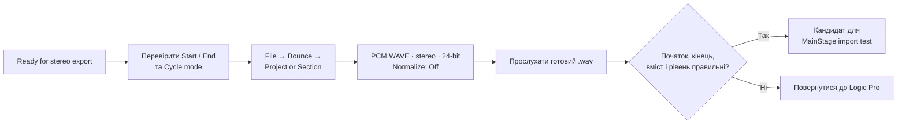

# Logic Pro: експорт одного stereo backing track

## Мета

Створити один незжатий stereo audio file для однієї пісні, який зберігає її затверджений мікс і буде перевірений у MainStage в наступній фазі. Ця процедура не створює stems і не змінює оригінальний проєкт Logic Pro.

## Коли застосовувати / коли не застосовувати

Застосовуй лише до пісні з результатом `Ready for stereo export` у [перевірці проєкту](10-logic-preflight.md).

Не застосовуй, якщо неясно, чи є в міксі живий основний вокал або жива акустична гітара. Не використовуй цю процедуру для пісні з темповими змінами як перший тест — повернися до неї, коли базовий export та MainStage import вже успішно перевірені на простій пісні.

## Пов’язані документи

- [Logic Pro: перевірка пісні](10-logic-preflight.md)
- [Контекст проєкту](00-project-context.md)
- [Майбутня основа Concert у MainStage](02-documentation-map.md#phase-1)
- [Реєстр сумісності](04-compatibility-register.md)

## Офіційні джерела

- [Apple: Bounce a project to an audio file](https://support.apple.com/guide/logicpro/bounce-a-project-to-an-audio-file-lgcp785a41c3/mac), перевірено 2026-07-26 — `File > Bounce`, Start/End, Cycle mode, normalization і `Include Audio Tail`.
- [Apple: Set the bounce range](https://support.apple.com/guide/logicpro/set-the-bounce-range-lgcp190ba9b7/mac), перевірено 2026-07-26 — bounce range залежить від Start/End, Cycle mode і selected regions.
- [Apple: Set the project sample rate](https://support.apple.com/guide/logicpro/set-the-project-sample-rate-lgcpce0958b8/mac), перевірено 2026-07-26 — не слід змінювати sample rate після запису або імпорту audio files, щоб уникнути змін pitch і playback speed; Logic узгоджує playback із hardware sample rate через conversion.
- [Apple: Position and length units](https://support.apple.com/guide/logicpro/change-the-position-and-length-of-events-lgcp215888c6/mac), перевірено 2026-07-26 — позиції у музичному режимі складаються з bars, beats, divisions і ticks; відлік кожної одиниці починається з 1.
- [Apple: The Playback Plug-in](https://help.apple.com/mainstage/mac/2.2/en/mainstage/usermanual/chapter_A_section_0.html), перевірено 2026-07-26 — Playback підтримує незжаті mono/stereo AIFF, WAV і CAF із bit depth 16 або 24 bits.

> **Статус сумісності формату:** Apple офіційно описує WAVE/AIFF/CAF для Playback, але перед використанням на сцені файл обов’язково має пройти реальний import test у встановленому MainStage 4.3. Цей export створює кандидат для тесту, а не концертно перевірений файл.

## Передумови

- Пісня має результат `Ready for stereo export` у [документі 10](10-logic-preflight.md).
- У повному міксі відсутні жива акустична гітара та основний вокал, або це окремо підтверджено як виняток.
- Усі `Solo` controls вимкнені, і ти чуєш повний узгоджений мікс.
- `Click` у цій пісні означає художній елемент **Finger snapping**, а не метроном. Він має залишитися в повному міксі і в export.
- Створено окрему папку для концертних файлів. Не зберігай backing track всередину папки оригінального Logic-проєкту, якщо це створює плутанину.

## Важливо: не змінюй sample rate проєкту

CQ-12T, MainStage і macOS зараз погоджені на `96 kHz`, але це **не** є причиною змінювати sample rate готового проєкту Logic Pro. Залиш project sample rate таким, яким він був під час створення пісні; він не є частиною цього кроку export. Apple застерігає, що зміна project sample rate після запису або імпорту може змінити висоту тону та швидкість відтворення audio files.

MainStage import test після export окремо підтвердить, що конкретний WAV-файл відтворюється коректно через CQ-12T. До того моменту не переробляй пісню під `96 kHz`.

## Рішення про формат для базової фази

Стартовий формат: **PCM WAVE (`.wav`), stereo, 24-bit, Normalize: `Off`**.

- `WAVE` і 24-bit входять до офіційно описаного переліку Playback formats.
- `Normalize: Off` означає, що Logic Pro не нормалізує файл. Це зберігає затверджене співвідношення рівнів у міксі; не треба змінювати гучність готової пісні лише тому, що вона переходить до MainStage.
- Не створюй MP3 для backing track: у цій базовій процедурі потрібен незжатий файл, сумісність якого описана для Playback.

## Кроки



### 1. Перевір межі export

1. Відкрий перевірену пісню в Logic Pro.
2. Переконайся, що повний мікс звучить правильно, а жодна доріжка не залишилася в `Solo`.
3. Переконайся, що `Click` / Finger snapping звучить як частина міксу. Не mute його.
4. Не вмикай `Cycle mode` для першої простої пісні, якщо тобі не потрібно обмежити export конкретним фрагментом.
5. Визнач, де пісня реально починається та закінчується. У наступному вікні Bounce це має відповідати `Start` і `End`.

**Чому:** якщо Cycle mode увімкнено під час `File > Bounce`, Logic Pro експортує тільки ділянку всередині cycle area.

### Як читати `Start` і `End` у вікні Bounce

Це **не секунди**. Кожне поле має чотири музичні координати:

```text
такт | доля | дрібна музична поділка | tick
```

Наприклад:

```text
2 1 1 1 = початок другого такту
6 1 1 1 = початок шостого такту
```

Отже bounce з `Start: 2 1 1 1` і `End: 6 1 1 1` містить тільки такти 2–5. За темпу 70 BPM і звичайного розміру 4/4 це близько 13,7 секунди — саме тому Logic показує біля вікна `Time 0:13`. Це не повна пісня, якщо вона не триває приблизно 13 секунд.

#### Безпечне повернення до повного діапазону

1. У вікні Bounce натисни `Cancel`. Це нічого не змінює у проєкті.
2. Повернись до `Tracks area` у головному вікні Logic Pro.
3. Подивися на кнопку `Cycle` у control bar. Якщо вона підсвічена жовтим, натисни її один раз, щоб вимкнути Cycle mode.
4. Клікни в порожньому місці `Tracks area`, де немає region. Перевір, що жоден region не залишився виділеним.
5. Знову відкрий `File > Bounce > Project or Section`.
6. За відсутності Cycle mode і вибраних regions Logic за замовчуванням ставить bounce range на весь проєкт — від його Start до End.
7. Подивися на рядок `Time` внизу вікна. Він має бути приблизно такої самої тривалості, як реальна пісня, а не `0:13`.
8. Якщо все ще показано тільки кілька секунд або кілька тактів, натисни `Cancel` і не експортуй: потрібна окрема перевірка project end / фактичних останніх regions у `Tracks area`.

> Пояснення Apple: при `File > Bounce > Project` без обмеження Cycle mode чи selected regions за замовчуванням експортується весь проєкт; Cycle і selected regions можуть звузити bounce range.

### 2. Відкрий вікно Bounce

1. У menu bar вибери `File > Bounce > Project or Section`.
2. У вікні Bounce перевір `Start` і `End`.
3. Якщо межі не охоплюють всю композицію, виправ `Start` і `End` у самому вікні Bounce. Не редагуй regions або tempo тільки для цього export.

Для «Цілуються хмари» не приймай `Start: 2 1 1 1`, `End: 6 1 1 1` і `Time 0:13` як весь трек: спочатку виконай розділ **«Безпечне повернення до повного діапазону»** вище.

**Перевірка:** Start стоїть до першого звуку, End — після завершення музики та потрібних природних effect tails.

### 3. Встанови файл export

1. У форматі audio file вибери `PCM` і `WAVE`.
2. Вибери `24-bit`.
3. Вибери `Normalize: Off`.
4. Якщо у твоєму вікні Bounce видно параметр `Sample Rate`, не змінюй його для цього першого export. Він має залишитися відповідним поточному проєкту Logic Pro.
5. `Include Audio Tail` використовуй лише якщо наприкінці пісні є потрібний reverb, delay або інший природний хвіст. Після export його обов’язково прослухай, бо Apple зазначає: деякі plug-ins можуть створити надто довгий файл при увімкненому tail.
6. Не вмикай MP3 або M4A для цього базового концертного файлу.

### 4. Назви й збережи файл

1. Вибери окрему папку для backing tracks.
2. Використай послідовну назву без неясних скорочень. Приклад:

   ```text
   01_Назва-пісні_BT_stereo_24bit.wav
   ```

3. Не використовуй слово `final` у назві, доки файл не пройшов import test у MainStage і повну репетицію.
4. Запусти Bounce та дочекайся завершення.

## Перевірка готового файла

1. Відкрий створений `.wav` у macOS і прослухай від початку до кінця.
2. Перевір чотири речі:

   - початок не обрізаний;
   - кінець не обрізаний і не має небажано довгої тиші;
   - немає живого основного вокалу або живої акустичної гітари;
   - рівень не містить явного clipping чи спотворення.

3. Якщо все правильно, додай до нотатки пісні:

   ```text
   Export file:
   Format: PCM WAVE, stereo, 24-bit
   Normalize: Off
   Audio tail: On / Off
   Desktop listening test: Pass
   ```

4. Якщо хоча б один пункт не пройдено, не імпортуй цей файл у MainStage. Виправ причину у Logic Pro або повернись до [перевірки пісні](10-logic-preflight.md).

## Очікуваний результат

Є один чітко названий `.wav` файл, який є кандидатом для MainStage: він містить погоджений stereo backing track, не стискається в MP3/M4A й не вважається сценічно готовим до import test.

## Типові помилки та безпечне відновлення

| Помилка | Причина | Безпечна дія |
| --- | --- | --- |
| Export закінчується занадто рано | Start/End або Cycle area не охопили всю пісню | Не редагувати файл вручну. Повернутися у Logic, перевірити межі й bounce знову |
| У файлі чутно живий вокал або акустичну гітару | Пісня не була готова до export | Позначити `Blocked`, повернутися до документа 10 і прийняти музичне рішення |
| Файл надто довгий після `Include Audio Tail` | Один із plug-ins продовжив генерувати звук | Спробувати export без цього параметра або з контрольованим End; прослухати результат |
| Файл звучить інакше за затверджений мікс | Неправильні Solo/Mute states або змінені settings | Не продовжувати. Відкрити проєкт, повернути повний мікс, перевірити та bounce знову |
| Назва не дозволяє зрозуміти версію | Файл легко переплутати на сцені | Перейменувати файл до import у MainStage, зберігаючи номер пісні й `BT_stereo_24bit` |

## Журнал змін

- 2026-07-26 — перша версія базового export; призначена для одного готового stereo backing track на пісню.
- 2026-07-26 — для «Цілуються хмари Logic Pro» уточнено: `Click` є Finger snapping і залишається; sample rate проєкту не змінюється під CQ/MainStage.
