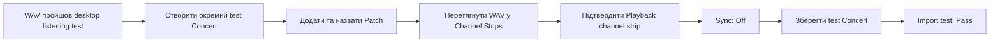

# MainStage: перший test Concert та import одного backing track

## Мета

Створити **окремий тестовий Concert**, додати до нього одну Patch «Цілуються хмари» та перевірити, що MainStage 4.3 приймає готовий WAV як stereo Playback channel strip. На цьому етапі не налаштовуються педаль, автоматичні переходи, повтор приспіву, гітара, вокал або концерт із 25 пісень.

## Результат, який має бути наприкінці

У MainStage існує збережений test Concert з однією Patch і одним завантаженим файлом `Цілуються-хмари_BT_stereo_24bit.wav`. Це підтверджує import. Відтворення через фізичну акустику — наступний, окремий тест.

## Передумови

- WAV-файл пройшов desktop listening test: `Pass`; див. [картку пісні](song-records/01-tsiluyutsia-khmary.md).
- CQ-12T підключений через USB, обраний у MainStage без помилки, а CQ, MainStage і macOS погоджені на `96 kHz`; див. [реєстр сумісності](04-compatibility-register.md).
- У тебе є доступ до WAV-файлу у Finder.
- Перед першим запуском playback вихідний рівень CQ-12T та активної колонки буде низьким або колонка буде вимкнена; див. [правила безпеки](05-audio-safety-and-power.md#cable-safety-rules).

## Офіційні джерела

- [Apple: Overview of Edit mode](https://support.apple.com/guide/mainstage/overview-of-edit-mode-mstg9b39ca1c/3.5/mac/10.15), перевірено 2026-07-26 — в `Edit mode` додають і організовують patches та channel strips.
- [Apple: Add patches in MainStage](https://support.apple.com/guide/mainstage/add-patches-mstg9da503fa/mac), перевірено 2026-07-26 — кнопка `Add Patch` (`+`) розміщена у верхньому правому куті `Patch List`; patch можна перейменувати подвійним кліком.
- [Apple: Add a Playback plug-in](https://support.apple.com/nl-nl/guide/mainstage/mstgd241cc7c/mac), перевірено 2026-07-26 — audio file можна перетягнути до `Channel Strips` area; MainStage створює channel strip із Playback plug-in. Playback — instrument plug-in на software instrument channel strip.
- [Apple: MainStage release notes](https://support.apple.com/en-la/101568), перевірено 2026-07-26 — перетягування stereo audio file до mixer створює stereo Playback channel strip.
- [Apple: Playback Sync, Snap To, and Play From](https://support.apple.com/guide/mainstage/mainstage-playback-sync-snap-play-parameters-mstge93aad2f/mac), перевірено 2026-07-26 — при `Sync: Off` файл відтворюється у своєму записаному темпі.

## Важливе рішення цього тесту

Перший backing track має один сталий темп `70 BPM`, але цей тест перевіряє **файл як записаний мікс**, а не синхронізацію музичних секцій. Тому після import встановлюємо `Sync: Off`. Це не остаточне рішення для повтору приспіву — його буде обрано й протестовано в окремому документі.

## Кроки

### 1. Створи ізольований test Concert

1. Відкрий MainStage.
2. Якщо MainStage показує вибір шаблону для нового Concert, вибери найпростіший порожній шаблон, який називається на твоєму екрані `Empty Concert` або аналогічно. Не обирай guitar, vocal, keyboard чи концертний template з готовими effects.
3. Якщо MainStage вже відкрив інший Concert, у menu bar вибери `File > New` і в діалозі обери найпростіший порожній template.
4. Відразу збережи новий Concert: `File > Save`.
5. Назви його, наприклад, `Backing Tracks — TEST.concert`. Збережи окремо від оригінального Logic Pro project і майбутнього основного Concert.

**Перевірка:** у title bar MainStage видно назву test Concert, а не назву твоєї пісні або невідомого template.

### 2. Перейди в Edit mode і створи Patch пісні

1. У верхній частині вікна MainStage знайди та натисни `Edit`.
2. Зліва знайди `Patch List`.
3. Якщо в списку вже є один patch, натисни його один раз. Якщо список порожній, натисни кнопку `+` у верхньому правому куті `Patch List`, щоб додати patch.
4. Двічі натисни назву вибраного patch у `Patch List`.
5. Впиши точну назву: `01 — Цілуються хмари` і натисни `Return`.

**Перевірка:** у `Patch List` є один чітко названий patch. Не додавай Set і не додавай наступні пісні.

### 3. Імпортуй WAV перетягуванням

1. Відкрий Finder так, щоб у ньому було видно `Цілуються-хмари_BT_stereo_24bit.wav`.
2. Розмісти Finder і MainStage поруч, щоб одночасно було видно файл та центральну область `Channel Strips` у MainStage.
3. У MainStage переконайся, що у `Patch List` вибрано `01 — Цілуються хмари`.
4. У Finder затисни WAV-файл і перетягни його в **порожнє місце** центральної області `Channel Strips` MainStage. Не перетягуй його на `Patch List`, не на `Workspace` і не на будь-яку кнопку.
5. Відпусти файл у `Channel Strips`.

**Очікуваний результат:** з’являється новий channel strip з інструментом `Playback`. Для stereo WAV MainStage має створити stereo Playback channel strip.

### 4. Перевір Playback і вимкни Sync

1. Натисни назву або slot `Playback` у створеному channel strip, щоб відкрити його вікно.
2. Знайди параметр `Sync`.
3. Встанови `Sync: Off`.
4. Не змінюй `Tempo`, `Flex Mode`, markers, `Snap To` або `Play From` на цьому етапі.
5. У полі `File` або у верхній частині Playback переконайся, що видно назву `Цілуються-хмари_BT_stereo_24bit.wav`.

**Перевірка:** Playback показує саме потрібний файл, а `Sync` має значення `Off`.

### 5. Збережи й зафіксуй import result

1. Вибери `File > Save`.
2. У картці пісні запиши `MainStage import test: Pass` лише якщо WAV видно у Playback без повідомлення про помилку.
3. Поки що не натискай Play і не перевіряй фізичний звук, якщо ще не виконано окремого безпечного підключення CQ-12T до домашньої акустики.

## Типові проблеми

| Симптом | Безпечна дія |
| --- | --- |
| WAV не перетягується або не з’являється Playback | Не переробляй WAV. Перевір, що виділено правильний patch та файл відпущено саме в `Channel Strips`; потім повтори один раз. |
| З’являється повідомлення про неправильний формат | Не конвертуй файл навмання. Зафіксуй точний текст помилки й повернись до картки пісні. |
| Створився channel strip, але не stereo | Зупинись і зафіксуй, як він позначений у MainStage; не переходь до playback test. |
| Не видно `Sync` | Відкрий саме plug-in `Playback`, а не загальні settings patch або channel strip. |

## Межа цього документа

Цей документ завершується import test. Тільки після його `Pass` буде створено окрему процедуру безпечного фізичного playback test через CQ-12T. Це навмисно не змішує перевірку файлу з перевіркою кабелів, виходів і рівнів.

## Журнал змін

- 2026-07-26 — перша версія; перший test Concert і import одного WAV.
