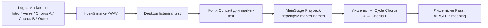

# MainStage Playback: marker-WAV та test повтору секції

## Мета

Створити **окрему** версію вже перевіреного stereo backing track, що містить marker information, і безпечно перевірити в MainStage 4.3, чи бачить Playback межі `Intro`, `Verse`, `Chorus A`, `Chorus B`, `Outro`.

Це не є ще налаштуванням AIRSTEP Lite і не є зміною робочого Concert. Педаль буде підключена лише після того, як marker navigation і Cycle пройдуть test екранними кнопками MainStage.

## Обраний підхід і його межа

Для першого test обрано один WAV із marker information.



Apple документує, що Marker List додається до audio file під час Bounce. У Playback marker-containing audio files можна використовувати для переходу між позиціями. В official legacy Playback documentation кнопка `Cycle` повторює ділянку між current marker і next marker; у MainStage 4.3 ми не вважаємо це підтвердженим, доки не протестуємо на твоєму MacBook.

## Пов’язані документи

- [Карта структури пісні](12-song-structure-sheet.md)
- [Базовий export WAV](11-logic-export-stereo-backing-track.md)
- [MainStage test Concert](13-mainstage-concert-foundation.md)
- [Картка «Цілуються хмари»](song-records/01-tsiluyutsia-khmary.md)

## Офіційні джерела

- [Apple: Use marker information from audio files](https://support.apple.com/guide/logicpro/use-marker-information-lgcpadb63ff8/mac), перевірено 2026-07-26 — current Marker List додається у recorded або bounced audio file.
- [Apple: Bounce a project to an audio file](https://support.apple.com/guide/logicpro/bounce-a-project-to-an-audio-file-lgcp785a41c3/mac), перевірено 2026-07-26 — `Include Tempo Information` визначає, чи зберігається tempo information у bounce.
- [Apple: Playback Sync, Snap To, Play From](https://support.apple.com/guide/mainstage/mainstage-playback-sync-snap-play-parameters-mstge93aad2f/mac), перевірено 2026-07-26 — Playback може стартувати з current marker.
- [Apple: Playing Back Audio in MainStage](https://help.apple.com/mainstage/mac/2.2/en/mainstage/usermanual/chapter_8_section_0.html), перевірено 2026-07-26 — legacy official documentation описує Playback markers і cycle. Це джерело пояснює концепцію, але поведінка у встановленому MainStage 4.3 обов’язково перевіряється окремим test.
- [Apple: Using the Playback Transport and Function Buttons](https://help.apple.com/mainstage/mac/2.2/en/mainstage/usermanual/chapter_A_section_3.html), перевірено 2026-07-26 — legacy official documentation прямо каже: `Cycle` повторює ділянку між current і next marker та автоматично застосовує crossfade у marker points для мінімізації clicks. Фактичний test у MainStage 4.3 це підтвердив для цієї пісні.

## Передумови

- У `Marker` track є п’ять markers: `Intro`, `Verse`, `Chorus A`, `Chorus B`, `Outro`.
- Поточний робочий файл `Цілуються-хмари_BT_stereo_24bit.wav` залишається недоторканим.
- У Logic Pro збережено project після створення markers.

## Крок 1: Bounce окремого marker-WAV

1. У Logic Pro натисни `File > Save`.
2. Відкрий `File > Bounce > Project or Section`.
3. Перевір, що `Start` і `End` охоплюють **ту саму повну пісню**, яка вже дала файл тривалістю `3:15`. Не приймай короткий діапазон на кшталт `Time 0:13`.
4. Залиш ті самі audio-налаштування, що пройшли попередній test:

   | Поле | Значення |
   | --- | --- |
   | File Type | `WAVE` |
   | Bit Depth | `24-bit` |
   | Sample Rate | `44.1 kHz` — поточна частота готового Logic project |
   | Format | `Interleaved` |
   | Dithering | `None` |
   | Normalize | `Off` |
   | Include Tempo Information | Увімкнено |

5. Збережи **поруч**, але з новою назвою:

   ```text
   Цілуються-хмари_BT_stereo_markers_24bit.wav
   ```

6. Натисни `OK` і дочекайся завершення.

## Крок 2: Прослухай саме marker-WAV

1. У Finder відкрий **новий** файл `Цілуються-хмари_BT_stereo_markers_24bit.wav`.
2. Прослухай від початку до кінця.
3. Перевір: той самий початок, finger snapping, повна тривалість близько `3:15`, нормальний кінець, без нового clipping або тиші.
4. Не замінюй ним файл у поточному MainStage Concert ще.

## Очікуваний результат цього кроку

Є два окремі файли:

```text
Цілуються-хмари_BT_stereo_24bit.wav            ← поточний робочий файл
Цілуються-хмари_BT_stereo_markers_24bit.wav    ← кандидат для marker-test
```

Надішли результат `Desktop listening test: Pass` або screenshot Bounce warning/поля `Time`, якщо виникне проблема. Лише після `Pass` створюємо копію MainStage Concert і завантажуємо marker-WAV у її `Track 1`.

## Крок 3: Створи копію Concert для marker-test { #step-3-create-a-copy }

1. У поточному Concert MainStage виконай `File > Save`.
2. Закрий MainStage: `MainStage > Quit MainStage`.
3. У Finder знайди `Backing Tracks — TEST.concert`.
4. Виділи файл і натисни `Command-D` (`File > Duplicate`).
5. Перейменуй копію на `Backing Tracks — MARKER TEST.concert`.
6. Відкрий саме копію подвійним натисканням у Finder.
7. У MainStage переконайся, що зліва вибрана Patch `01 — Цілуються хмари`.

**Перевірка безпеки:** у title bar має бути `Backing Tracks — MARKER TEST`. Якщо там досі `Backing Tracks — TEST`, не завантажуй marker-WAV.

## Крок 4: Завантаж marker-WAV у `Track 1` копії Concert

1. У `Edit mode` знайди перший Playback strip `Track 1`.
2. Натисни його зелену кнопку `Playback`.
3. У вікні plug-in натисни поле `File` або menu `Action` праворуч від waveform, потім вибери `Open File`.
4. У Finder dialog вибери лише `Цілуються-хмари_BT_stereo_markers_24bit.wav` і натисни `Open`.
5. Переконайся, що поле `File` показує саме marker-WAV, а `Sync` досі `Off`.
6. Закрий вікно Playback. На channel strip `Track 1` перевір, що `Output` досі `Out 13–14`.
7. Виконай `File > Save`.

Apple підтверджує, що audio file завантажується через `File` field або `Action > Open File`; ця операція стосується лише відкритого Playback instance у MARKER TEST copy.

## Крок 5: Перевір marker import, але не запускай Cycle

1. Знову відкрий `Track 1 > Playback`.
2. Зроби screenshot усього Playback window: waveform, поле `File`, `Sync` і всі видимі marker labels/lines.
3. Не натискай `Cycle`, `Play`, `Go to Next Marker` або AIRSTEP Lite до перевірки screenshot.

Очікуваний результат: MainStage показує marker boundaries/назви, завантажені з нового WAV. Якщо їх не видно, основний Concert не постраждає: ми працюємо тільки в MARKER TEST copy.

### Фактичний результат «Цілуються хмари»

Marker import пройшов: screenshot показує `Current Marker: Intro`, `Next Marker: Verse` і marker label `Intro` у waveform.

У screenshot поле output самого `B-Track 1` закрите вікном Playback. Видимі `Output 1–2` належать **іншим** B-Track strips, які не містять нашого файла. Користувач підтвердив, що `B-Track 1` уже має правильний `Out 13–14`; routing не змінюємо.

## Крок 6: Контрольований test `Chorus A → Chorus B` без педалі

### A. Перейди до `Chorus A`, не запускаючи audio

1. У вікні `B-Track 1 > Playback` знайди внизу поле `PLAY FROM`. На screenshot воно має значення `Start`.
2. Натисни це поле й обери **`Current Marker`**.
3. Не змінюй `SYNC: Off` та `SNAP TO: Off` у цьому першому test.
4. Закрий вікно Playback червоною macOS-кнопкою, щоб побачити центральні screen controls MainStage.
5. Натисни `Return`. `Current Marker` має бути `Intro`, `Next Marker` — `Verse`.
6. Натисни маленьку праву стрілку біля `Next Marker` один раз. Очікувано: `Current Marker = Verse`, `Next Marker = Chorus A`.
7. Натисни цю саму праву стрілку ще раз. Очікувано: `Current Marker = Chorus A`, `Next Marker = Chorus B`.

Якщо дві назви не збігаються, натисни `Return` і повтори лише ці два натискання. Не натискай `Play` до правильного стану.

### B. Перевір один повтор `Chorus A`

1. Почни з низького рівня навушників CQ.
2. Натисни кнопку `Cycle` у центральній області MainStage, щоб вона перейшла в активний стан.
3. Натисни `Play`.
4. Слухай щонайменше **35 секунд**. При 70 BPM та 4/4 ділянка `Chorus A` (bar 17 → 25) триває близько 27,4 секунди, тому має відбутися один повний повтор.
5. Очікувано: на межі `Chorus B` audio повертається на початок `Chorus A` без чутного клацання, тріску, короткого обриву звуку або паузи.
6. Під час другого проходу натисни `Cycle` ще раз, щоб вимкнути його.
7. На наступній marker boundary audio має продовжитися в `Chorus B`, а не повертатися до `Chorus A`.
8. Натисни `Stop` після того, як чітко почуєш початок `Chorus B`.

Apple описує `Current Marker` як старт із marker ліворуч від поточної позиції. Legacy official Playback documentation описує `Cycle` як повтор між current і next marker з автоматичним crossfade у marker points. Реальний результат у MainStage 4.3 фіксуємо саме цим test.

## Результат, який потрібно повідомити

```text
Navigation: Pass / Fail
Cycle Chorus A: Pass / Fail
Release to Chorus B: Pass / Fail
Чи було чутно дефект на межі повтору (клацання, тріск, обрив або пауза): Ні / опис
```

## Типові помилки та безпечне відновлення

| Симптом | Безпечна дія |
| --- | --- |
| Bounce створює 13-second файл | Натисни `Cancel`, повернись до перевірки повного Start/End у [документі export](11-logic-export-stereo-backing-track.md#how-to-read-start-end). |
| Нова версія звучить інакше | Не імпортуй її у MainStage. Перевір Solo/Mute states та Bounce settings. |
| У filename немає `markers` | Перейменуй до імпорту, щоб не замінити робочий WAV помилково. |
| Не видно markers у MainStage пізніше | Не перезаписуй робочий WAV. Зафіксуй screenshot Playback і перевіримо marker import окремо. |
| Видно `Output 1–2` на інших порожніх B-Track | Нічого не змінюй: для routing важливий лише `B-Track 1` із завантаженим marker-WAV. |
| Після двох Next-marker натискань не видно `Chorus A → Chorus B` | Натисни `Return` і повтори. Не відраховуй позицію вручну по waveform. |
| Cycle не вимикається або повертається не туди | Натисни `Stop`, не зберігай нових налаштувань, зроби screenshot центральних marker controls і Playback window. |

## Журнал змін

- 2026-07-26 — створено після успішного створення Marker List для «Цілуються хмари». Обрано безпечний test marker-WAV у новому файлі; фактичний Cycle та AIRSTEP mapping ще не виконані.
- 2026-07-26 — marker-WAV пройшов desktop listening test. Додано ізольований процес `MARKER TEST.concert` і завантаження файла через `Playback > File` / `Action > Open File`.
- 2026-07-26 — marker import для «Цілуються хмари» підтверджено. Подальша перевірка screenshot уточнила, що видимі `Output 1–2` належать іншим B-Track; `B-Track 1` із marker-WAV уже зберігає `Out 13–14`.
- 2026-07-26 — додано перший контрольований marker navigation/Cycle test без AIRSTEP: `Chorus A` (bar 17) до `Chorus B` (bar 25), тобто 8 тактів.
- 2026-07-26 — test `Navigation`, `Cycle Chorus A` і `Release to Chorus B` пройшов (`Pass`). Користувач підтвердив плавне повернення `Chorus B → Chorus A`, без чутних клацань, тріску, обриву або паузи; він сприймається як плавний fade. Це узгоджується з офіційним описом Apple: `Cycle` автоматично застосовує crossfade у marker points, щоб мінімізувати clicks.
