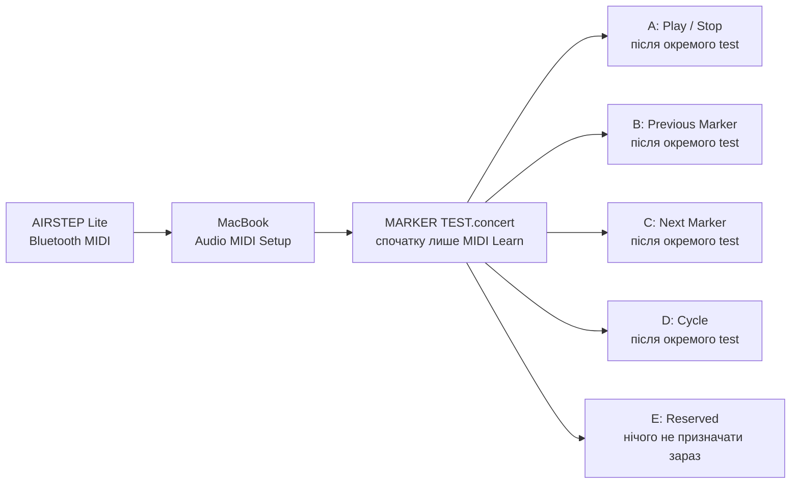

# AIRSTEP Lite: Bluetooth MIDI та безпечне призначення кнопок

## Мета

Під’єднати **XSONIC AIRSTEP Lite** до MacBook як **Bluetooth MIDI** controller, переконатися, що MainStage 4.3 бачить натискання кнопок, а потім призначити лише перевірені команди Playback.

Перший практичний крок цього документа **не змінює** routing CQ-12T, аудіофайл, маркери або робочий Concert. Він лише створює MIDI-з’єднання між педаллю та macOS.

## Коли застосовувати / коли не застосовувати

Застосовуй після успішного test `Navigation`, `Cycle Chorus A` і `Release to Chorus B` у [marker Playback test](14-mainstage-playback-options.md).

Не застосовуй цей документ для керування TC-Helicon або CQ-12T: AIRSTEP Lite має лише Bluetooth MIDI/HID і не має USB чи 5-pin MIDI портів. У цій фазі використовуємо **MIDI**, а не HID keyboard messages.

## Пов’язані документи

- [Marker-WAV і повтор приспіву](14-mainstage-playback-options.md)
- [MainStage test Concert](13-mainstage-concert-foundation.md)
- [Картка пісні «Цілуються хмари»](song-records/01-tsiluyutsia-khmary.md)
- [Правила доказовості](01-evidence-policy.md)

## Офіційні джерела

- [Apple: Set up Bluetooth MIDI devices in Audio MIDI Setup on Mac](https://support.apple.com/guide/audio-midi-setup/ams33f013765/mac), перевірено 2026-07-26 — Mac як Bluetooth MIDI host: `Window > Show MIDI Studio` → `Configure Bluetooth` → вибрати peripheral → `Connect`.
- [Apple: Learn a controller assignment in MainStage](https://support.apple.com/guide/mainstage/mstg338d4728/mac), перевірено 2026-07-26 — `Assign & Map` навчає hardware control; для button Apple вказує натиснути його рівно тричі, не надто швидко.
- [Apple: Create assignments and mappings together in MainStage](https://support.apple.com/guide/mainstage/mstg3006f42a/mac), перевірено 2026-07-26 — можна відкрити таблицю через `Assignments & Mappings`, а `Assign & Map` створює assignment після руху hardware control.
- [Apple: Test your MIDI connection in Audio MIDI Setup](https://support.apple.com/guide/audio-midi-setup/ams668e66f1d/mac), перевірено 2026-07-26 — `Test MIDI Setup` у MIDI Studio дозволяє перевірити MIDI In; при отриманні message на іконці device підсвічується up arrow (`In` port).
- [XSONIC: AIRSTEP Lite product page](https://xsonicaudio.com/products/airstep-lite), перевірено 2026-07-26 — AIRSTEP Lite передає MIDI та HID через Bluetooth, має п’ять footswitches; у нього немає USB/5-pin MIDI для цього проєкту.

**Важлива межа джерел:** пошук знайшов опис режимів Lite, що посилається на XSONIC Help Center, але не знайшов його чинну пряму офіційну сторінку. Тому ця документація **не використовує** кольори indicator або комбінації кнопок як інструкцію. Якщо звичайно увімкнений Lite не з’явиться у Bluetooth MIDI list, спершу робимо screenshot і перевіряємо фактичний стан, а не перемикаємо режими навмання.

## План безпечного розподілу кнопок

Порядок кнопок на педалі зліва направо позначаємо `A`, `B`, `C`, `D`, `E`. Це поки що **план**, не готовий mapping.



`E` навмисно лишається без дії як запасна кнопка. Не будемо робити одну кнопку одночасно `Play`, `Stop` і `Cycle`.

## Крок 1: під’єднати AIRSTEP Lite як Bluetooth MIDI

### Перед початком

- [ ] Playback у MainStage зупинений (`Stop`).
- [ ] MainStage закритий. Це виключає випадкову реакцію на вже задані в педалі MIDI/HID messages під час pairing.
- [ ] CQ-12T, USB audio routing і навушники можна залишити як є: цей крок не стосується audio device.
- [ ] AIRSTEP Lite заряджений достатньо для test. Кабель заряджання не потрібен для Bluetooth MIDI.
- [ ] Якщо на iPhone/iPad відкрито застосунок AIRSTEP, закрий його на час першого pairing з MacBook. Нічого в застосунку не редагуй і не скидай до factory settings.

### Увімкни Lite без зміни його налаштувань

1. Перемкни фізичний power switch AIRSTEP Lite у `Off`.
2. Увімкни його **звичайно**, не утримуючи жодної footswitch button.
3. Не натискай жодну з п’яти кнопок і не відкривай AIRSTEP App Editor. На цьому етапі ми не змінюємо preset педалі.

### Створи Bluetooth MIDI connection у macOS

1. У macOS натисни `Command-Space`.
2. Надрукуй **Audio MIDI Setup**.
3. Натисни `Return`. Відкриється застосунок із вікном audio devices — це нормально.
4. У верхньому меню екрана вибери `Window > Show MIDI Studio`.
5. У новому вікні **MIDI Studio** знайди вгорі кнопку **Configure Bluetooth**. Її піктограма має вигляд Bluetooth.
6. Натисни **Configure Bluetooth**.
7. У списку Bluetooth MIDI devices знайди назву, що містить `AIRSTEP` або `AIRSTEP Lite`.
8. Один раз натисни цю назву, щоб виділити її.
9. Натисни **Connect**.
10. Не змінюй audio settings, speaker layout або формат CQ12T у цьому застосунку. Для AIRSTEP потрібне лише MIDI Studio connection.

## Очікуваний результат

У Bluetooth MIDI window пристрій AIRSTEP має показуватися як під’єднаний (`Connected`). Не вважай pairing успішним лише тому, що назва видна у списку: потрібен саме статус після натискання `Connect`.

## Як перевірити

1. Зроби один screenshot Bluetooth MIDI window після натискання `Connect`.
2. Напиши точну назву, яку побачив у списку, та один із двох результатів:

```text
AIRSTEP Bluetooth MIDI: Pass — [точна назва пристрою]
```

або

```text
AIRSTEP Bluetooth MIDI: Fail — [що саме видно / повідомлення]
```

Лише після `Pass` відкриємо **MARKER TEST.concert** та зробимо MIDI Learn для однієї кнопки. Ми не призначаємо всі п’ять кнопок одразу.

## Чому в `Assign & Map` немає слова Bluetooth

Bluetooth встановлюється **поза MainStage**, у macOS через `Audio MIDI Setup`. Після connection macOS подає AIRSTEP Lite у MainStage як звичайний MIDI input. Тому MainStage не показує ще один Bluetooth selector у `Assign & Map`.

Вікно на screenshot із назвами на кшталт `Play/Stop (From Start)` — це **Parameter Mapping browser**. Воно відповідає на питання: «Що має робити вибрана екранна кнопка `Play`?» Воно не є списком пристроїв і не доводить, що з педалі вже надійшло MIDI message.

Apple вказує важливу передумову: hardware control можна призначити лише тоді, коли він надсилає standard MIDI messages. AIRSTEP Lite уміє надсилати і MIDI, і HID keyboard messages, а тип та повідомлення для кожної footswitch редагуються у AIRSTEP App. Тому перед MainStage MIDI Learn обов’язково робимо незалежний test MIDI In у macOS.

## Крок 2: перевірити, чи AIRSTEP реально надсилає MIDI

Цей крок нічого не змінює у Concert і не потребує AIRSTEP App.

1. У MainStage натисни червону `Assign & Map` ще раз, щоб вона перестала бути червоною. Це закриє режим mapping/learning.
2. Не зберігай `MARKER TEST.concert` на цьому етапі.
3. Закрий MainStage.
4. У `Audio MIDI Setup` вибери `Window > Show MIDI Studio`.
5. Якщо поверх нього відкрите маленьке вікно **Bluetooth Configuration**, закрий його червоною кнопкою. Не натискай `Disconnect`.
6. У верхній панелі MIDI Studio знайди кнопку **Test MIDI Setup**. Якщо назва неочевидна, наведи pointer на іконки — macOS покаже tooltip із точною назвою.
7. Натисни **Test MIDI Setup** один раз, щоб увімкнути test mode.
8. На іконці **AIRSTEP Lite** знайди маленьку стрілку, що вказує **вгору**. Це `MIDI In` port — дані *від педалі до MacBook*.
9. Натисни **лише ліву фізичну кнопку** AIRSTEP Lite один раз.
10. Подивись, чи up arrow на іконці AIRSTEP Lite коротко підсвітився.
11. Натисни **Test MIDI Setup** ще раз, щоб вийти з test mode.

### Як трактувати результат

| Результат | Що це означає | Наступна дія |
| --- | --- | --- |
| Up arrow підсвітився | MacBook отримав MIDI від педалі. Bluetooth і MIDI layer працюють. | Повертаємося до MainStage й робимо один точний MIDI Learn. |
| Up arrow не підсвітився | Connection є, але ця footswitch не надіслала MIDI. Вона може бути задана як HID або мати інший preset. | Не призначай нічого в MainStage. Окремо перевіримо AIRSTEP App і налаштуємо саме MIDI message. |

## Крок 3: призначити лише кнопку `A` для `Play` у test Concert

Виконуй цей крок **лише якщо up arrow у кроці 2 підсвітився**. Це призначення робиться в `Backing Tracks — MARKER TEST.concert`, а не в основному робочому Concert.

1. Закрий маленьке вікно **Bluetooth Configuration** червоною кнопкою вгорі ліворуч. Не натискай `Disconnect`.
2. Відкрий MainStage та завантаж **`Backing Tracks — MARKER TEST.concert`**.
3. У Patch List вибери `01 — Цілуються хмари`.
4. Переконайся, що playback зупинений. За потреби натисни екранну кнопку `Stop` у центральній області.
5. Не відкривай вікно plug-in `Playback`.
6. У центральній області Workspace знайди маленьку екранну кнопку з підписом **`Play`** (у твоєму template вона під полем `Current Marker`, лівіше від `Stop`). Натисни **саме цю екранну кнопку один раз**. Вона має отримати blue selection outline.
7. Угорі Workspace натисни **`Assign & Map`**. Кнопка має засвітитися red: MainStage тепер чекає MIDI message.
8. Натисни **лише ліву фізичну кнопку AIRSTEP Lite** рівно три рази, з невеликою паузою між натисканнями. Це вимога Apple саме для button assignment.
9. Знову натисни **`Assign & Map`**, щоб завершити learn mode.
10. Нічого не натискай на інших чотирьох footswitches.

### Безпечний test

1. Натисни ліву кнопку AIRSTEP Lite **один раз**.
2. Очікування: екранний `Play` активується, playback починається, а meter `B-Track 1` рухається.
3. Негайно зупини звук **екранною** кнопкою `Stop` у MainStage. Зараз педаль `Stop` ще не призначена.
4. Зроби screenshot усього MainStage window, бажано коли видно вибраний `Play` або нижній Control Inspector після assignment.

Не зберігай Concert, якщо AIRSTEP button запускає щось інше, ніж `Play`, або якщо ти не впевнений, що assignment створився саме для кнопки `Play`.

## Результат кроків 2–3

```text
AIRSTEP MIDI In: Pass / Fail
AIRSTEP A → Play: Pass / Fail
Що сталося після одного натискання A: [опис]
```

## Типові помилки та безпечне відновлення

| Симптом | Причина / безпечна дія |
| --- | --- |
| AIRSTEP немає у списку | Вимкни й увімкни Lite звичайно, не утримуючи footswitch, зачекай 10 секунд, натисни `Configure Bluetooth` знову. Не змінюй CQ audio settings, preset педалі або її firmware; зроби screenshot, якщо назва не з’явилась. |
| Назва є, але `Connect` не спрацьовує | Зроби screenshot. Не factory-reset і не перепризначай кнопки; спочатку перевіримо точний стан. |
| Після pairing почався audio playback | Натисни `Stop` у MainStage після його відкриття. Pairing сам по собі не змінює audio routing; подальший MIDI Learn виконуємо в test Concert. |
| У `Assign & Map` видно лише назви Playback commands | Це нормальний Parameter Mapping browser, а не Bluetooth menu. Вийди з `Assign & Map` і спочатку виконай test MIDI In у кроці 2. |
| AIRSTEP є у Bluetooth Configuration, але up arrow не світиться | Не змінюй mapping у MainStage. Це означає, що треба перевірити preset/message type в AIRSTEP App; XSONIC підтверджує, що Lite може надсилати як MIDI, так і HID, а ці параметри редагуються в app. |
| Після `Assign & Map` лунає звук ще під час трьох натискань | Натисни екранний `Stop`, заверши `Assign & Map` повторним натисканням і зроби screenshot. Не чіпай інші footswitches. |
| Кнопка A запускає не `Play` | Не зберігай Concert. Зроби screenshot вибраного screen control і Control Inspector; ми приберемо лише помилковий assignment у test Concert. |

## Журнал змін

- 2026-07-26 — документ створено після успішного marker navigation/Cycle test першої пісні.
- 2026-07-26 — Bluetooth MIDI pairing `Pass`: у Audio MIDI Setup видно `AIRSTEP Lite`, `MIDI Input/MIDI Output`, а кнопка `Disconnect` підтверджує активне connection. MIDI Learn ще не виконано.
- 2026-07-26 — перший `AIRSTEP A → Play` test позначено `Fail`: screenshot показав Parameter Mapping browser у MainStage, але не фактичний MIDI input від footswitch. Процедуру виправлено: перед MIDI Learn обов’язковий незалежний `Test MIDI Setup` у macOS.
