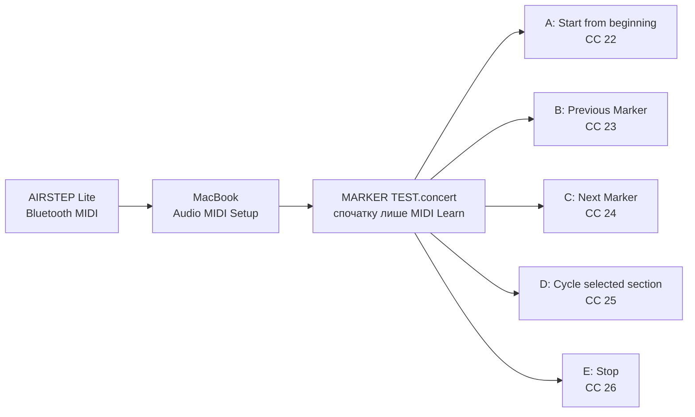

# AIRSTEP Lite: Bluetooth MIDI та безпечне призначення кнопок

## Мета

Під’єднати **XSONIC AIRSTEP Lite** до MacBook як **Bluetooth MIDI** controller, переконатися, що MainStage 4.3 бачить натискання кнопок, а потім призначити лише перевірені команди Playback.

Перший практичний крок цього документа **не змінює** routing CQ-12T, аудіофайл, маркери або робочий Concert. Він лише створює MIDI-з’єднання між педаллю та macOS.

## Коли застосовувати / коли не застосовувати

Застосовуй після успішного test `Navigation`, `Cycle Chorus A` і `Release to Chorus B` у [marker Playback test](14-mainstage-playback-options.md).

Не застосовуй цей документ для керування TC-Helicon або CQ-12T: AIRSTEP Lite має лише Bluetooth MIDI/HID і не має USB чи 5-pin MIDI портів. У цій фазі використовуємо **MIDI**, а не HID keyboard messages.

## Пов’язані документи

- [Marker-WAV і повтор приспіву](14-mainstage-playback-options.md)
- [MainStage test Concert](13-mainstage-concert-foundation.md)
- [Картка пісні «Цілуються хмари»](song-records/01-tsiluyutsia-khmary.md)
- [Правила доказовості](01-evidence-policy.md)

## Офіційні джерела

- [Apple: Set up Bluetooth MIDI devices in Audio MIDI Setup on Mac](https://support.apple.com/guide/audio-midi-setup/ams33f013765/mac), перевірено 2026-07-26 — Mac як Bluetooth MIDI host: `Window > Show MIDI Studio` → `Configure Bluetooth` → вибрати peripheral → `Connect`.
- [Apple: Learn a controller assignment in MainStage](https://support.apple.com/guide/mainstage/mstg338d4728/mac), перевірено 2026-07-26 — `Assign & Map` навчає hardware control; для button Apple вказує натиснути його рівно тричі, не надто швидко.
- [Apple: Create assignments and mappings together in MainStage](https://support.apple.com/guide/mainstage/mstg3006f42a/mac), перевірено 2026-07-26 — можна відкрити таблицю через `Assignments & Mappings`, а `Assign & Map` створює assignment після руху hardware control.
- [Apple: Test your MIDI connection in Audio MIDI Setup](https://support.apple.com/guide/audio-midi-setup/ams668e66f1d/mac), перевірено 2026-07-26 — `Test MIDI Setup` у MIDI Studio дозволяє перевірити MIDI In; при отриманні message на іконці device підсвічується up arrow (`In` port).
- [XSONIC: AIRSTEP Lite product page](https://xsonicaudio.com/products/airstep-lite), перевірено 2026-07-26 — AIRSTEP Lite передає MIDI та HID через Bluetooth, має п’ять footswitches; у нього немає USB/5-pin MIDI для цього проєкту.
- [AIRSTEP app — App Store, XSONIC Inc.](https://apps.apple.com/pl/app/airstep/id1487765085?l=pl), перевірено 2026-07-26 — офіційний editor для AIRSTEP Lite; через Bluetooth редагує preset і параметри MIDI/HID messages, а також передає preset на педаль.
- [XSONIC: AIRSTEP User Manual](https://help.xsonicaudio.com/user_manual/1), перевірено 2026-07-26 — для inspection у застосунку виробник описує команду `Touch to Connect AIRSTEP`, вибір пристрою та окремо зазначає, що firmware 1.7+ підтримує до трьох одночасних Bluetooth connections.
- [Ableton: Toggle and Momentary MIDI functions](https://help.ableton.com/hc/en-us/articles/209774945-Toggle-and-Momentary-MIDI-functions), перевірено 2026-07-26 — незалежне офіційне пояснення пар `127` / `0`, momentary messages і меж LED feedback контролера.
- [Gig Performer Community: global backing/cue-track controls](https://community.gigperformer.com/t/global-rackspace-player-controls-for-backing-cue-tracks-plus-tempo-map/21590), перевірено 2026-07-26 — приклад реального workflow з synchronized `Play/Pause/Stop` і окремою підготовкою пісенних preset; це практичне джерело, не документація MainStage.

**Важлива межа джерел:** не використовуємо кольори indicator або комбінації кнопок як інструкцію для цього проєкту. Якщо звичайно увімкнений Lite не з’явиться у Bluetooth MIDI list, спершу робимо screenshot і перевіряємо фактичний стан, а не перемикаємо режими навмання.

## План безпечного розподілу кнопок

Порядок кнопок на педалі зліва направо позначаємо `A`, `B`, `C`, `D`, `E`. Це поки що **план**, не готовий mapping.



Жодна кнопка не має подвійної дії. `E` — не «резерв», а окрема команда `Stop`: це дає безпечний спосіб зупинити backing track, не змінюючи marker і не вимикаючи `Cycle` навмання.

## Крок 1: під’єднати AIRSTEP Lite як Bluetooth MIDI

### Перед початком

- [ ] Playback у MainStage зупинений (`Stop`).
- [ ] MainStage закритий. Це виключає випадкову реакцію на вже задані в педалі MIDI/HID messages під час pairing.
- [ ] CQ-12T, USB audio routing і навушники можна залишити як є: цей крок не стосується audio device.
- [ ] AIRSTEP Lite заряджений достатньо для test. Кабель заряджання не потрібен для Bluetooth MIDI.
- [ ] Якщо на iPhone/iPad відкрито застосунок AIRSTEP, закрий його на час першого pairing з MacBook. Нічого в застосунку не редагуй і не скидай до factory settings.

### Увімкни Lite без зміни його налаштувань

1. Перемкни фізичний power switch AIRSTEP Lite у `Off`.
2. Увімкни його **звичайно**, не утримуючи жодної footswitch button.
3. Не натискай жодну з п’яти кнопок і не відкривай AIRSTEP App Editor. На цьому етапі ми не змінюємо preset педалі.

### Створи Bluetooth MIDI connection у macOS

1. У macOS натисни `Command-Space`.
2. Надрукуй **Audio MIDI Setup**.
3. Натисни `Return`. Відкриється застосунок із вікном audio devices — це нормально.
4. У верхньому меню екрана вибери `Window > Show MIDI Studio`.
5. У новому вікні **MIDI Studio** знайди вгорі кнопку **Configure Bluetooth**. Її піктограма має вигляд Bluetooth.
6. Натисни **Configure Bluetooth**.
7. У списку Bluetooth MIDI devices знайди назву, що містить `AIRSTEP` або `AIRSTEP Lite`.
8. Один раз натисни цю назву, щоб виділити її.
9. Натисни **Connect**.
10. Не змінюй audio settings, speaker layout або формат CQ12T у цьому застосунку. Для AIRSTEP потрібне лише MIDI Studio connection.

## Очікуваний результат

У Bluetooth MIDI window пристрій AIRSTEP має показуватися як під’єднаний (`Connected`). Не вважай pairing успішним лише тому, що назва видна у списку: потрібен саме статус після натискання `Connect`.

## Як перевірити

1. Зроби один screenshot Bluetooth MIDI window після натискання `Connect`.
2. Напиши точну назву, яку побачив у списку, та один із двох результатів:

```text
AIRSTEP Bluetooth MIDI: Pass — [точна назва пристрою]
```

або

```text
AIRSTEP Bluetooth MIDI: Fail — [що саме видно / повідомлення]
```

Лише після `Pass` відкриємо **MARKER TEST.concert** та зробимо MIDI Learn для однієї кнопки. Ми не призначаємо всі п’ять кнопок одразу.

## Чому в `Assign & Map` немає слова Bluetooth

Bluetooth встановлюється **поза MainStage**, у macOS через `Audio MIDI Setup`. Після connection macOS подає AIRSTEP Lite у MainStage як звичайний MIDI input. Тому MainStage не показує ще один Bluetooth selector у `Assign & Map`.

Вікно на screenshot із назвами на кшталт `Play/Stop (From Start)` — це **Parameter Mapping browser**. Воно відповідає на питання: «Що має робити вибрана екранна кнопка `Play`?» Воно не є списком пристроїв і не доводить, що з педалі вже надійшло MIDI message.

Apple вказує важливу передумову: hardware control можна призначити лише тоді, коли він надсилає standard MIDI messages. AIRSTEP Lite уміє надсилати і MIDI, і HID keyboard messages, а тип та повідомлення для кожної footswitch редагуються у AIRSTEP App. Тому перед MainStage MIDI Learn обов’язково робимо незалежний test MIDI In у macOS.

## Крок 2: перевірити, чи AIRSTEP реально надсилає MIDI

Цей крок нічого не змінює у Concert і не потребує AIRSTEP App.

1. У MainStage натисни червону `Assign & Map` ще раз, щоб вона перестала бути червоною. Це закриє режим mapping/learning.
2. Не зберігай `MARKER TEST.concert` на цьому етапі.
3. Закрий MainStage.
4. У `Audio MIDI Setup` вибери `Window > Show MIDI Studio`.
5. Якщо поверх нього відкрите маленьке вікно **Bluetooth Configuration**, закрий його червоною кнопкою. Не натискай `Disconnect`.
6. У верхній панелі MIDI Studio знайди кнопку **Test MIDI Setup**. Якщо назва неочевидна, наведи pointer на іконки — macOS покаже tooltip із точною назвою.
7. Натисни **Test MIDI Setup** один раз, щоб увімкнути test mode.
8. На devices, де macOS показує маленьку стрілку, що вказує **вгору**, це `MIDI In` port — дані *від педалі до MacBook*.
9. Натисни **лише ліву фізичну кнопку** AIRSTEP Lite один раз.
10. Якщо на твоїй іконці AIRSTEP Lite є up arrow, подивись, чи вона коротко підсвітилася.
11. Натисни **Test MIDI Setup** ще раз, щоб вийти з test mode.

**Фактичний результат цього MacBook (2026-07-26):** у MIDI Studio Tahoe іконка AIRSTEP Lite не має видимих In/Out arrows, тому цей Apple visual test не дає окремого індикатора саме для цього BLE endpoint. Разом із `AIRSTEP A → Play: Fail` у MainStage це означає: спершу перевіряємо, який message задано для footswitch у preset педалі.

### Як трактувати результат

| Результат | Що це означає | Наступна дія |
| --- | --- | --- |
| Up arrow підсвітився | MacBook отримав MIDI від педалі. Bluetooth і MIDI layer працюють. | Повертаємося до MainStage й робимо один точний MIDI Learn. |
| Up arrow не підсвітився | Connection є, але ця footswitch не надіслала MIDI. Вона може бути задана як HID або мати інший preset. | Не призначай нічого в MainStage. Окремо перевіримо AIRSTEP App і налаштуємо саме MIDI message. |
| На іконці немає up arrow, як у цьому MacBook | Apple visual test не показує port activity для цього Bluetooth endpoint. | Не роби висновків за відсутністю кольору. Перейди до inspection preset у AIRSTEP App. |

## Крок 3: відкрити preset у AIRSTEP App — тільки inspection

Цей крок визначає **де** задається MIDI для педалі. AIRSTEP Lite налаштовується в AIRSTEP App, а MainStage лише вивчає MIDI message, який уже надсилає педаль.

1. На iPhone або iPad відкрий App Store.
2. Знайди застосунок **`AIRSTEP`** від **`XSONIC Inc.`**. Не обирай `AIRSTEP Play` і не обирай `AIRSTEP Updater`.
3. Встанови та відкрий `AIRSTEP`.
4. Увімкни AIRSTEP Lite як звичайно.
5. Не від’єднуй MacBook. За чинним посібником XSONIC, firmware 1.7+ допускає одночасну роботу до трьох Bluetooth connections; отже app на iPhone/iPad і MIDI connection з MacBook спочатку можуть залишатися активними разом.
6. У версіях app, описаних XSONIC, натисни **`Touch to Connect AIRSTEP`** і у списку вибери **`AIRSTEP Lite`**. На screenshot цього проєкту такого нижнього напису не видно, натомість угорі праворуч є статус **`Not Connected`**. Перевірка користувача 2026-07-26 підтвердила: у цій версії це лише текст, не кнопка. Не намагайся натискати його повторно й не шукай приховану комбінацію кнопок педалі.
7. Після connection **нічого не редагуй**: не завантажуй online preset, не запускай firmware update, не натискай reset і не зберігай preset.
8. Зроби screenshot першого екрана app, де видно current preset та список/налаштування footswitches. Якщо для лівої кнопки є окремий екран, відкрий його, але не міняй жодне значення, і зроби ще один screenshot.

### Уже встановлений факт: поточний екран застосунку

Screenshot від 2026-07-26 показує preset **`MIDI PC`**, `AirStep Local Preset 1` і для **Lite**:

| Button | Показане повідомлення |
| --- | --- |
| `A` | `PC 0` → `MIDI` → `1 Msg` |
| `B` | `PC 1` → `MIDI` → `1 Msg` |
| `C` | `PC 2` → `MIDI` → `1 Msg` |
| `D` | `PC 3` → `MIDI` → `1 Msg` |
| `E` | `PC 4` → `MIDI` → `1 Msg` |

Отже, показаний preset **не є HID preset**: `A` задумано як MIDI **Program Change 0**.

### Виправлення інтерпретації `Not Connected`

Попереднє трактування цього напису було помилковим. `Not Connected` стоїть **у верхній секції `AIRSTEP`**. Її поля `MIDI IN`, `EXP1` і `EXP2` відповідають повній педалі AIRSTEP. За офіційною специфікацією XSONIC, AIRSTEP Lite не має MIDI In і входів expression pedal. Нижня секція **`LITE`** із власними `A`–`E`, батареєю та `AirStep Local Preset` стосується саме педалі користувача.

Факт, що фізична кнопка `Fn` перемикає `AirStep Local Preset` 1–5 у нижній секції, є позитивним доказом: Lite увімкнений, її local preset mechanism працює, а app бачить її стан. Відсутність анімації у нижніх кружках `A`–`E` під час натискань не є доказом несправності: цей екран описує конфігурацію messages, а не є MIDI monitor.

Отже, не перемикаємо режим Lite і не робимо reset. Наступний доказ потрібен не з анімації app, а з фактичного MIDI message, який отримує MainStage або окремий MIDI monitor.

## Крок 3: призначити лише кнопку `A` для `Play` у test Concert

### Крок 3A: альтернативний історичний маршрут `PC → CC` — не виконувати

Цей підрозділ збережено лише як пояснення первинного плану. Для реального Concert користувача він **замінений** Local Preset 2 і підтвердженою картою `CC 22–26` у [Кроці 4](#крок-4-повна-концертна-карта-be). Не створюй тут `CC 20` і не редагуй Local Preset 1.

**Навіщо це потрібно:** factory preset `MIDI PC` у цьому проєкті показує `Lite A = PC 0`. MainStage вміє реагувати на Program Change, але використовує його також для вибору Patch; поточні release notes прямо описують поведінку MainStage для incoming Program Change. Для окремої команди Playback використовуємо MIDI **Control Change (CC)**: це окремий, стабільний і не пов’язаний із номером song-patch message.

Виконуй це у **нижній секції `LITE`** AIRSTEP app. Верхню секцію `AIRSTEP` не чіпай: вона належить повній педалі, якої в цьому сетапі немає.

1. Переконайся, що внизу вибрано **`AirStep Local Preset 1`** (у screenshot він має світлий фон). Це буде наш окремий preset `MainStage — Playback`. Інші `2–5` не змінюй.
2. Зроби screenshot нижньої секції `LITE` перед зміною. Це резервний запис поточного `PC 0`.
3. Натисни **екранний блок `A` у нижній секції `LITE`**, а не фізичну кнопку A на педалі. Має відкритися footswitch/message edit page.
4. Для єдиного press-message задай такі значення:

   | Поле в app | Значення |
   | --- | --- |
   | `Trigger` | `Press` |
   | `Message Type` | `MIDI` |
   | `MIDI Type` | `Control Change` / `CC` |
   | `MIDI Channel` | `1` |
   | `CC Number` | `20` |
   | `CC Value` | `127` |
   | `Output Interface` | `Bluetooth MIDI` (якщо є цей точний вибір); якщо Lite показує лише `ALL`, залиш `ALL` |

5. Якщо в editor є `Toggle Mode`, встанови **`Off`** / `Normal`. Для `Play` нам потрібна momentary дія, а не стан, який педаль зберігає між натисканнями.
6. Додай або налаштуй окреме release-message лише якщо editor прямо показує окремий `Release` trigger:

   | Поле в app | Значення |
   | --- | --- |
   | `Trigger` | `Release` |
   | `Message Type` | `MIDI` |
   | `MIDI Type` | `Control Change` / `CC` |
   | `MIDI Channel` | `1` |
   | `CC Number` | `20` |
   | `CC Value` | `0` |
   | `Output Interface` | `Bluetooth MIDI` або `ALL` за правилом кроку 4 |

   Якщо редактор не показує `Release`, **не вигадуй друге повідомлення**: збережи лише press `CC 20 = 127` і надішли screenshot.
7. Натисни `Done` лише на edit page, щоб застосунок повернувся до нижньої панелі `LITE`. Не натискай загальну кнопку `Save` у верхньому правому куті, доки ми не побачимо screenshot edit page та нижньої `LITE` панелі після зміни.

**Очікуваний результат:** у нижній панелі Lite для `A` замість `PC 0` видно `CC 20` або `Control Change 20`. Фізична педаль може не змінювати візуальний стан app при натисканні — наступний крок окремо перевіряє отримання CC MainStage.

**Чому `CC 20`:** резервуємо `CC 20–24` тільки для цього Concert (`A=20`, а майбутні `B=21`, `C=22`, `D=23`, `E=24`). Не використовуємо `CC 7` і `CC 10`, бо вони часто мають окремі значення volume/pan.

### Виняток для фактичного Local Preset 2: не редагувати перед першим test

Screenshot від 2026-07-26 показав, що **`AirStep Local Preset 2` має назву `MIDI CC`** і вже надсилає з нижньої Lite-панелі:

| Lite button | Фактичне повідомлення |
| --- | --- |
| `A` | `CC 22`, `Toggle Msg` |
| `B` | `CC 24`, `Toggle Msg` |
| `C` | `CC 25`, `Toggle Msg` |
| `D` | `CC 10`, `1 Msg` |
| `E` | `CC 11`, `1 Msg` |

Для першого доказового тесту обираємо **Local Preset 2** і лишаємо його без змін. Lite `A = CC 22` достатньо, щоб перевірити, чи MainStage бачить message і виконує `Play/Stop`. Це скасовує потребу відразу створювати `CC 20`; резерв `CC 20–24` залишаємо для фінальної концертної карти після `Pass`.

**Фактичний результат 2026-07-26:** MIDI In і MainStage learn — `Pass`. Фізична A запускає playback, тобто Bluetooth MIDI, CC і assignment працюють. Але `Toggle Msg` надсилає `127` на першому натисканні, `0` на другому, знов `127` на третьому. Через це команда playback спрацьовує лише на кожному другому натисканні, а LED Lite показує стан самої кнопки, а не стан MainStage. Це не дефект педалі чи Concert.

### Не видаляти Local Preset 1–5

XSONIC документує, що в AIRSTEP можна локально зберігати **до п’яти** presets, але перевірені джерела не описують безпечного видалення окремого local slot. Тому не шукай `Delete`, не роби factory reset і не перезаписуй `1`, `3`, `4`, `5` у цій фазі.

Щоб випадкове натискання `Fn` згодом не змінило поведінку на сцені, після успішного test ми **скопіюємо однакову перевірену MainStage-конфігурацію у всі п’ять local slots**. Це безпечніше за «порожні» або невідомі slots: незалежно від номера, кнопки працюватимуть однаково. До того моменту перед кожним test перевіряй, що внизу app підсвічений номер **`2`**.

### Крок 3B: призначити CC 22 до `Play/Stop` у test Concert

Виконуй цей крок з вибраним **Local Preset 2 `MIDI CC`**. Це призначення робиться в `Backing Tracks — MARKER TEST.concert`, а не в основному робочому Concert.

1. Закрий маленьке вікно **Bluetooth Configuration** червоною кнопкою вгорі ліворуч. Не натискай `Disconnect`.
2. Відкрий MainStage та завантаж **`Backing Tracks — MARKER TEST.concert`**.
3. У Patch List вибери `01 — Цілуються хмари`.
4. Переконайся, що playback зупинений. За потреби натисни екранну кнопку `Stop` у центральній області.
5. Не відкривай вікно plug-in `Playback`.
6. У центральній області Workspace знайди маленьку екранну кнопку з підписом **`Play`** (у твоєму template вона під полем `Current Marker`, лівіше від `Stop`). Натисни **саме цю екранну кнопку один раз**. Вона має отримати blue selection outline.
7. Угорі Workspace натисни **`Assign & Map`**. Кнопка має засвітитися red: MainStage тепер чекає MIDI message.
8. Натисни **лише ліву фізичну кнопку AIRSTEP Lite** рівно три рази, з невеликою паузою між натисканнями. У Local Preset 2 вона надсилає `CC 22`; це вимога Apple саме для button assignment.
9. Знову натисни **`Assign & Map`**, щоб завершити learn mode.
10. Нічого не натискай на інших чотирьох footswitches.

### Безпечний test

1. Натисни ліву кнопку AIRSTEP Lite **один раз**.
2. Очікування: екранний `Play` активується, playback починається, а meter `B-Track 1` рухається.
3. Натисни A ще раз. Оскільки factory mapping `CC 22` є `Toggle Msg`, перевіряємо, чи екранний `Play/Stop` зупиняє playback. Якщо ні — зупини звук **екранною** кнопкою `Stop`; жодних інших кнопок Lite не натискай.
4. Зроби screenshot усього MainStage window, бажано коли видно вибраний `Play` або нижній Control Inspector після assignment.

Не зберігай Concert, якщо AIRSTEP button запускає щось інше, ніж `Play`, або якщо ти не впевнений, що assignment створився саме для кнопки `Play`.

### Крок 3C: прибрати `Toggle` з A, не змінюючи її номер CC

Це наступний крок **після фактичного `Pass` MIDI In**. Мета не в тому, щоб LED відображав playback, а в тому, щоб **кожне фізичне натискання A надсилало однакову команду `CC 22 = 127`**. Такий stateless press-trigger надійніший для transport: його не може розсинхронізувати ручний `Stop` у MainStage, зміна patch або будь-яка інша дія поза педаллю.

1. У AIRSTEP app залиш **`AirStep Local Preset 2`** активним.
2. Натисни **екранний** блок `A` у нижній секції `LITE`. Не натискай фізичну A.
3. Фактичний screenshot `Switch LA` від 2026-07-26 підтвердив точні поля цієї версії app: `Toggle Mode` увімкнений; `Trigger: Press`; у `Toggle On` задано `MIDI → ALL → Control Change → Channel 1 → CC 22 → value 127`; у `Toggle Off` задано той самий CC зі значенням `0`.
4. Натисни перемикач **`Toggle Mode`** праворуч від його назви, щоб він став **Off**. **Важливо: ця версія AIRSTEP app створює нове normal-message зі значеннями за замовчуванням `CC Number 0` та `CC Value 0`; вона не переносить автоматично `22` і `127` із `Toggle On`.**
5. У блоці `Message 1` натисни рядок **`CC Number`** і встанови **`22`**. Потім натисни рядок **`CC Value`** і встанови **`127`**. Залиш: `Trigger: Press`, `Message Type: MIDI`, `Output Interface: ALL`, `MIDI Type: Control Change`, `MIDI Channel: 1`. Блок `Toggle Off` із value `0` має зникнути; не додавай `Release = 0`.
6. Натисни **синю круглу кнопку з галочкою** у верхньому правому куті. На цьому екрані вона завершує редагування `Switch LA`; це не factory reset і не зміна інших Local Presets.
7. Повернись до нижньої панелі `LITE` та зроби screenshot, де видно Local Preset 2 й новий стан A.
8. Повернись у `Backing Tracks — MARKER TEST.concert`. Не роби MIDI Learn заново: номер CC не змінився.
9. Натисни A один раз, дочекайся старту; зупини екранною `Stop`. Повтори це ще двічі. Усі три натискання A мають запускати playback. Якщо LED Lite після відпускання гасне — це очікувано: без MIDI feedback він не є індикатором playback MainStage.

**Стоп-умова:** якщо один short press одразу і запускає, і зупиняє playback, нічого більше не змінюй; зроби screenshot edit page та MainStage. Тоді окремо перевіримо варіант `Press 127` без release або іншу команду Playback.

**Фактичний результат 2026-07-26:** цей test пройшов тричі: `A → playback start`, екранний `Stop`, `A → playback start`. Transport `A` готовий. Користувач повідомив, що LED Lite світиться постійно у вибраному `LED Display: Normal Mode`; це не впливає на MIDI command.

### LED педалі: що можливо зараз

Потрібно розрізняти два різні завдання:

1. **Кнопка має щоразу виконувати transport-команду.** Це вже реалізовано: кожен press надсилає `CC 22 = 127`.
2. **LED має достовірно відображати фактичний `Play` MainStage.** Для цього MainStage мусить після кожної зміни playback надіслати назад у Lite спеціальне MIDI feedback message, а Lite мусить прийняти його та змінити LED.

Цього другого ланцюга ми **не налаштовуємо і не обіцяємо** для поточної конфігурації. Офіційна специфікація XSONIC для Lite описує її як Bluetooth MIDI/HID **output** controller; у документації MainStage feedback згадується для конкретно підтримуваних controller profiles (зокрема Arturia KeyLab), але Apple не документує generic Play-state feedback для AIRSTEP Lite. Наявність `MIDI Input/MIDI Output` у macOS не є достатнім доказом підтримки LED feedback протоколу.

Офіційний старший посібник AIRSTEP визначає `Normal Mode` LED як індикацію поточного trigger, а `Toggle Mode` — як локальний стан першого/другого trigger. Жоден із цих режимів сам по собі не знає, чи MainStage був зупинений мишею, через Patch change або через іншу команду. Тому LED не використовуємо як stage-critical playback indicator.

Якщо постійний LED заважає, безпечна окрема дія — відкрити рядок `LED Display` і спочатку зробити screenshot усіх доступних варіантів, **нічого не вибираючи**. Тільки якщо там є точний пункт `Off`, можемо зробити окремий test «LED вимкнено, MIDI A працює». Це прибере світло, але не створить синхронізацію.

### Концертний принцип керування педаллю

Це не «єдиний професійний стандарт», а обережний принцип, який повторюється у документації MIDI-контролерів і реальних live-backtrack workflow:

| Тип дії | Режим кнопки | Чому |
| --- | --- | --- |
| Transport (`Play`, `Stop`, перехід до marker) | Одна передбачувана команда на натискання; не `Toggle Msg` | На сцені кожен press має давати дію незалежно від попередньої LED-фази. |
| Стан, що справді має лишатися увімкненим (`Cycle`, effect on/off) | `Toggle` лише після окремого test і лише коли ми розуміємо feedback | Toggle природно чергує `127` та `0`, тому LED може показувати стан педалі, але не обов’язково стан MainStage. |
| Аварійна команда | Окрема кнопка, без подвійного призначення | Її не можна поєднувати з `Cycle` або переходом marker. |
| Пісня / patch selection | Окрема команда або інший режим | Не змішуємо з transport; Program Change у MainStage має власну логіку вибору patch. |

XSONIC прямо документує для AIRSTEP/Lite три triggers (`press`, `release`, `long press`) і окремий toggle mode; отже pedal може реалізувати цю карту. [Ableton незалежно пояснює](https://help.ableton.com/hc/en-us/articles/209774945-Toggle-and-Momentary-MIDI-functions) саму причину виявленої поведінки: toggle чергує `127` і `0`, тоді як momentary використовує `127` при натисканні та `0` при відпусканні; вони також попереджають, що LED контролера може не збігатися зі станом програми. Для реального backing-track workflow [приклад Gig Performer](https://community.gigperformer.com/t/global-rackspace-player-controls-for-backing-cue-tracks-plus-tempo-map/21590) тримає `Play/Pause/Stop` синхронізованими й окремими від підготовки preset/track. Це підтверджує принцип розділених, передбачуваних концертних команд, але не є документацією MainStage.

## Крок 4: повна концертна карта B–E

Це **один маршрут**, але не одна масова дія: налаштуй усі чотири кнопки в AIRSTEP app, а потім прив’язуй і перевіряй їх у MainStage по одній. Так будь-яке помилкове призначення одразу видно й не торкається підтвердженої `A`.

### Готова карта кнопок

| Button | Назва для поля `Name` у Lite (необов’язково) | Повідомлення | Екранний control MainStage | Сценічне призначення |
| --- | --- | --- | --- | --- |
| `A` | `Start` | `CC 22 = 127` | `Play` → `Play/Stop (From Start)` | Запустити пісню від початку. Уже `Pass`. |
| `B` | `Previous Marker` | `CC 23 = 127` | маленька стрілка **`<`** під `Current Marker` | Повернутися до попередньої секції. |
| `C` | `Next Marker` | `CC 24 = 127` | маленька стрілка **`>`** під `Next Marker` | Перейти до наступної секції. |
| `D` | `Cycle` | `CC 25 = 127` | кнопка `Cycle` | Увімкнути/вимкнути повтор поточної marker-секції, наприклад `Chorus A`. |
| `E` | `Stop` | `CC 26 = 127` | кнопка `Stop` | Негайно зупинити playback. |

**Чому саме CC 22–26:** вони не перетинаються з поточними `CC 7` (volume) та `CC 10` (pan) і не використовують `CC 11` (часто expression). Apple окремо зазначає, що MainStage має спеціальну логіку для CC 7 та CC 10, тому їх не використовуємо для concert commands. Не використовуй `Program Change` для B–E: він буде окремим майбутнім шаром для вибору song patches.

Apple release notes прямо підтверджують існування Playback `Next Marker`, `Previous Marker` і `Cycle` commands та виправлення їхньої роботи. Для нашого template найбезпечніше прив’язати hardware до **видимих screen controls**, а не шукати назву параметра вручну: MainStage сам створить коректний mapping для вибраного control.

### Частина 4A: запрограмувати B–E в AIRSTEP app

Перед початком: MainStage може бути відкритим, але playback має бути зупинений. У lower panel має бути вибраний **`AirStep Local Preset 2`**.

Для **кожної** кнопки `B`, `C`, `D`, `E` виконай однаковий шаблон. Натискай **екранну плитку** в нижній секції `LITE`, не фізичну кнопку на підлозі.

1. Відкрий потрібну кнопку.
2. Вимкни `Toggle Mode`.
3. Пам’ятай зафіксований факт цієї версії app: після кроку 2 вона скидає normal `Message 1` до `CC Number 0` і `CC Value 0`.
4. У `Message 1` встанови за таблицею нижче `CC Number` і `CC Value 127`.
5. Залиш усі спільні поля такими: `Trigger: Press`; `Message Type: MIDI`; `Output Interface: ALL`; `MIDI Type: Control Change`; `MIDI Channel: 1`.
6. Натисни синю галочку вгорі праворуч, щоб застосувати саме цю кнопку.
7. Повернись до нижньої панелі й лише тоді відкривай наступну кнопку.

| Lite button | `CC Number` | Що перевірити перед галочкою |
| --- | --- | --- |
| `B` | `23` | `Press`, channel `1`, `CC 23`, value `127` |
| `C` | `24` | `Press`, channel `1`, `CC 24`, value `127` |
| `D` | `25` | `Press`, channel `1`, `CC 25`, value `127` |
| `E` | `26` | `Press`, channel `1`, `CC 26`, value `127` |

**Не додавай `Message 2`, `Release` або long press.** У цій фазі кожна кнопка передає рівно одну команду. Це прибирає двозначність і повторює уже перевірений принцип кнопки A.

Після завершення `B–E` зроби один screenshot нижньої секції `LITE`: там мають бути видимі `CC 22`, `CC 23`, `CC 24`, `CC 25`, `CC 26` зліва направо.

### Частина 4B: прив’язати B–E в MainStage

Відкрий **`Backing Tracks — MARKER TEST.concert`** і Patch `01 — Цілуються хмари`. Виконуй чотири короткі цикли нижче в указаному порядку. Під час кожного циклу інші footswitches не натискай.

Для кожної кнопки діє один шаблон MainStage:

1. Натисни **відповідний екранний control** з таблиці.
2. Натисни `Assign & Map` у верхній частині Workspace: він стане червоним.
3. Натисни **лише відповідну фізичну кнопку** Lite рівно три рази, не надто швидко.
4. Натисни `Assign & Map` ще раз, щоб вийти з learn mode.
5. Переконайся, що у верхньому `MIDI IN` на останньому натисканні видно відповідну трійку: `1 23 127`, `1 24 127`, `1 25 127` або `1 26 127`.
6. Зроби зазначений нижче test відразу, до mapping наступної кнопки.

#### B — Previous Marker

1. Екранною стрілкою **`>`** один раз перейди з `Intro` до `Verse`, щоб B було куди повертати.
2. Прив’яжи `B` до екранної стрілки **`<`**.
3. Натисни B один раз.
4. `Current Marker` має змінитися з `Verse` на `Intro`. Звук не повинен початися.

#### C — Next Marker

1. Залиш playback зупиненим, `Current Marker = Intro`.
2. Прив’яжи `C` до екранної стрілки **`>`**.
3. Натисни C один раз.
4. `Current Marker` має змінитися з `Intro` на `Verse`. Звук не повинен початися.

#### D — Cycle

1. За допомогою вже перевіреної C двічі обери `Chorus A`: `Intro → Verse → Chorus A`.
2. Прив’яжи `D` до екранної кнопки `Cycle`.
3. Натисни D один раз: екранна `Cycle` має змінити стан на увімкнений.
4. Натисни D ще раз: `Cycle` має повернутися у вимкнений стан. Звук не повинен початися.
5. Лише після цього зроби повний музичний test: запусти playback A, дійди або перейди до `Chorus A`, натисни D для `Cycle`, переконайся, що `Chorus A` плавно повторюється; натисни D ще раз і переконайся, що playback продовжується в `Chorus B`.

#### E — Stop

1. Прив’яжи `E` до екранної кнопки `Stop`.
2. Натисни A, переконайся, що meter `B-Track 1` рухається.
3. Натисни E один раз.
4. Playback і meter мають зупинитися. `Current Marker` і стан `Cycle` не повинні змінитися лише від `Stop`.
5. Натисни A ще раз: пісня має знову стартувати від початку.

### Частина 4C: фінальний маршрут (`FULL ROUTE`)

Цей маршрут виконуй лише після `Pass` B–E:

1. Натисни E, щоб точно зупинити playback.
2. Натисни C: `Intro → Verse`; натисни B: `Verse → Intro`.
3. Натисни C двічі: `Intro → Verse → Chorus A`.
4. Натисни D: `Cycle` увімкнений.
5. Натисни A: playback стартує від початку. У потрібний момент за допомогою C перейди до `Chorus A`, якщо саме так працює твій test Concert.
6. Переконайся у плавному повторі `Chorus A`.
7. Натисни D: `Cycle` вимкнений; playback має продовжитися до `Chorus B`.
8. Натисни E: playback зупиняється.
9. Натисни A: пісня знову стартує від початку.

**Умова `Pass`:** жодна кнопка не запускає іншу дію, MIDI IN показує правильні `1 / CC / 127`, marker navigation не запускає звук сама, D керує тільки Cycle, E керує тільки Stop, A лишається стабільним Start.

**Фактичний результат 2026-07-26:** `FULL ROUTE: Pass` — `A Start`, `B Previous Marker`, `C Next Marker`, `D Cycle`, `E Stop`.

### Примітка про B під час playback

Користувач підтвердив практичну поведінку: коли playback уже перебуває всередині секції, перший press B повертає до **початку поточної** marker-секції, а другий — до попередньої. Це не помилка mapping. Пояснення MainStage Playback: команда `Go to Previous Marker` у режимі playback переходить до marker ліворуч від **поточної позиції playhead**. Тому в середині `Verse` найближчий marker ліворуч — початок `Verse`; лише після цього попереднім стає `Intro`.

Ця поведінка корисна як захист від випадкового стрибка на цілу секцію назад. У поточному Concert її прийнято як робочу: **один B = повторити поточну секцію з її початку; два B = перейти на попередню секцію.** Це не оголошується універсальним правилом усіх систем; це фактична поведінка саме цього Playback test.

### Відкладено: перемикання пісень через Program Change

Користувач свідомо відклав керування **наступною / довільною піснею** через MIDI `Program Change (PC)` на пізнішу фазу. До того часу:

- не призначай `PC 0–4` із Local Preset 1 до patch selection;
- не змінюй перевірений Local Preset 2 `CC 22–26`;
- не проектуй «Next Song» лише з п’ятьма кнопками: для ~25 пісень треба окремо вибрати підтверджену схему bank/page, patch list або інший розподіл;
- повертаємося до PC тільки після створення щонайменше кількох готових song patches і фіксації першого set order.

Apple release notes підтверджують, що incoming Program Change у MainStage використовується для patch selection; це саме причина, чому PC не змішується з transport CC. Пізніше перед зміною зробимо окремий research gate для фактичної схеми 25 пісень і окремий test Concert.

## Результат кроків 2–3

```text
AIRSTEP MIDI In: Pass / Fail
AIRSTEP App preset inspection: Pass / Fail
AIRSTEP A → Play: Pass / Fail
AIRSTEP B → Previous Marker: Pass / Fail
AIRSTEP C → Next Marker: Pass / Fail
AIRSTEP D → Cycle: Pass / Fail
AIRSTEP E → Stop: Pass / Fail
FULL ROUTE: Pass / Fail
Що сталося після одного натискання A: [опис]
```

## Типові помилки та безпечне відновлення

| Симптом | Причина / безпечна дія |
| --- | --- |
| AIRSTEP немає у списку | Вимкни й увімкни Lite звичайно, не утримуючи footswitch, зачекай 10 секунд, натисни `Configure Bluetooth` знову. Не змінюй CQ audio settings, preset педалі або її firmware; зроби screenshot, якщо назва не з’явилась. |
| Назва є, але `Connect` не спрацьовує | Зроби screenshot. Не factory-reset і не перепризначай кнопки; спочатку перевіримо точний стан. |
| Після pairing почався audio playback | Натисни `Stop` у MainStage після його відкриття. Pairing сам по собі не змінює audio routing; подальший MIDI Learn виконуємо в test Concert. |
| У `Assign & Map` видно лише назви Playback commands | Це нормальний Parameter Mapping browser, а не Bluetooth menu. Вийди з `Assign & Map` і спочатку виконай test MIDI In у кроці 2. |
| AIRSTEP є у Bluetooth Configuration, але up arrow не світиться | Не змінюй mapping у MainStage. Це означає, що треба перевірити preset/message type в AIRSTEP App; XSONIC підтверджує, що Lite може надсилати як MIDI, так і HID, а ці параметри редагуються в app. |
| У верхній панелі `AIRSTEP` написано `Not Connected` | Це не status Lite. Верхня панель належить повному AIRSTEP (має `MIDI IN`, `EXP1`, `EXP2`), нижня `LITE` — окрема панель фізичної Lite. Не вважай цей текст помилкою підключення Lite і не роби reset через нього. |
| Після `Assign & Map` лунає звук ще під час трьох натискань | Натисни екранний `Stop`, заверши `Assign & Map` повторним натисканням і зроби screenshot. Не чіпай інші footswitches. |
| Кнопка A запускає не `Play` | Не зберігай Concert. Зроби screenshot вибраного screen control і Control Inspector; ми приберемо лише помилковий assignment у test Concert. |

## Журнал змін

- 2026-07-26 — документ створено після успішного marker navigation/Cycle test першої пісні.
- 2026-07-26 — Bluetooth MIDI pairing `Pass`: у Audio MIDI Setup видно `AIRSTEP Lite`, `MIDI Input/MIDI Output`, а кнопка `Disconnect` підтверджує активне connection. MIDI Learn ще не виконано.
- 2026-07-26 — перший `AIRSTEP A → Play` test позначено `Fail`: screenshot показав Parameter Mapping browser у MainStage, але не фактичний MIDI input від footswitch. Процедуру виправлено: перед MIDI Learn обов’язковий незалежний `Test MIDI Setup` у macOS.
- 2026-07-26 — фактичний screenshot macOS Tahoe уточнив межу Apple visual test: іконка BLE endpoint AIRSTEP Lite не показує видимих In/Out arrows. Основний evidence для наступної дії — MainStage не отримав MIDI learn від кнопки. Додано безпечний inspection preset у офіційному AIRSTEP App без змін значень.
- 2026-07-26 — screenshot офіційного AIRSTEP App уточнив конфігурацію: показаний `MIDI PC` preset, `Local Preset 1`, а Lite `A` має `PC 0`, `MIDI`, `1 Msg`. Отже попередня гіпотеза про HID для цієї показаної кнопки відхилена.
- 2026-07-26 — повторний аналіз screenshot після оновлення Lite до firmware 1.9.7 виправив помилку документації: `Not Connected` належить верхній панелі повного AIRSTEP, не Lite. Це видно з `MIDI IN`, `EXP1`, `EXP2`, яких Lite за специфікацією не має. Нижня панель `LITE` показує battery і `AirStep Local Preset`; фізична `Fn` реально перемикає local presets. Отже немає підстав вважати Lite непідключеною або бракованою через цей напис.
- 2026-07-26 — `AIRSTEP MIDI In: Pass`, `AIRSTEP A → Play: Pass` для приймання CC 22 і запуску playback. Виявлено не дефект, а невідповідний transport режим: `Toggle Msg` чергує `127`/`0`, тому MainStage transport реагує на кожен другий press, а LED Lite не відображає playback MainStage. Додано окремий контрольований крок 3C: перетворити A на один press-trigger `CC 22 = 127`, не змінюючи її MIDI assignment.
- 2026-07-26 — фактичний screenshot normal-mode edit page виправив інструкцію: після вимкнення `Toggle Mode` ця версія AIRSTEP app скинула новий `Message 1` до `CC Number 0`, `CC Value 0`. MainStage показав відповідний вхід `1 0 0`. Це очікувано пояснює відсутність action, бо assignment MainStage уже вивчений для CC 22. Обов’язкове виправлення — вручну встановити `CC Number 22` і `CC Value 127` перед натисканням галочки.
- 2026-07-26 — `Toggle Mode: Off`, `CC 22 = 127` відновлено; три повтори `A → start; екранний Stop; A → start` пройшли. Transport A зафіксовано як `Pass`. LED Lite за повідомленням користувача світиться постійно; додано джерельно обмежений висновок: для його синхронізації з MainStage потрібен generic двосторонній MIDI feedback, який Apple/XSONIC не документують для цієї пари. LED не є індикатором стану playback.
