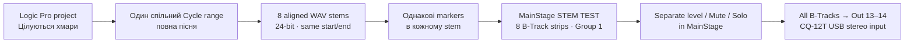

# Stems: Logic Pro → MainStage для окремого міксу

## Мета

Для однієї готової пісні створити **окремий WAV stem для кожної потрібної доріжки**, додати до кожного той самий набір marker information і завантажити їх у вісім `B-Track` channel strips MainStage. Результат: на сцені можна окремо змінювати рівень, `Mute` і `Solo` барабанів, басу, клавіш, бек-вокалу тощо, а MainStage все одно віддає один узгоджений stereo mix у CQ-12T через `Out 13–14`.

Це **не** налаштування восьми незалежних фізичних каналів на CQ-12T або FOH. У цій фазі окремий контроль відбувається в MainStage, а після нього stems сумуються в один stereo output — саме той формат, який користувач обрав для FOH.

## Коли застосовувати / коли не застосовувати

Застосовуй до `01 — Цілуються хмари`, бо для неї вже є:

- готовий stereo master і успішний audio test;
- marker map `Intro → Verse → Chorus A → Chorus B → Outro`;
- перевірені Playback navigation, `Cycle` і AIRSTEP `A–E`.

Не починай масовий export інших пісень, доки ця перша stem-пісня не пройде `STEM CONCERT: Pass`. Так ми не створимо десятки файлів з неперевіреним marker workflow.

## Пов’язані документи

- [Картка пісні «Цілуються хмари»](song-records/01-tsiluyutsia-khmary.md)
- [Карта структури та markers](12-song-structure-sheet.md)
- [Stereo export як уже перевірений контрольний мікс](11-logic-export-stereo-backing-track.md)
- [Playback та marker/Cycle test](14-mainstage-playback-options.md)
- [AIRSTEP Lite full route](16-airstep-lite-mapping.md)
- [CQ-12T та stereo output](17-cq12t-mainstage-and-foh.md)

## Офіційні джерела

- [Apple: Export tracks as audio files in Logic Pro](https://support.apple.com/guide/logicpro/export-tracks-as-audio-files-lgcpb27f70f9/mac), перевірено 2026-07-26 — Logic може експортувати один або кілька selected tracks як окремі audio files; описані `Range`, `Include Audio Tail`, `Include Volume/Pan Automation`, `Normalize` і naming pattern.
- [Apple: Use marker information from audio files in Logic Pro](https://support.apple.com/guide/logicpro/use-marker-information-lgcpadb63ff8/mac), перевірено 2026-07-26 — Marker List додається при record/bounce; також Logic надає `Navigate > Other > Export Marker to Audio File` для selected audio region.
- [Apple: MainStage release notes](https://support.apple.com/en-us/101568), перевірено 2026-07-26 — MainStage має Playback marker support; release notes окремо згадують `8 Backing Tracks`, grouped Playback tracks і коректну роботу при переході до markers.
- [Apple: MainStage controller assignment](https://support.apple.com/guide/mainstage/mstg338d4728/mac), перевірено 2026-07-26 — для MIDI button learn використовують `Assign & Map`; цей документ не змінює вже перевірену карту AIRSTEP.

## Рішення для цієї пісні



### Карта stems для `01 — Цілуються хмари`

| MainStage strip | Logic track | Stem filename ending | Призначення |
| --- | --- | --- | --- |
| `B-Track 1` | `Drum` | `01_Drum.wav` | барабани |
| `B-Track 2` | `Bass` | `02_Bass.wav` | бас |
| `B-Track 3` | `Piano` | `03_Piano.wav` | піано |
| `B-Track 4` | `Other` | `04_Other.wav` | інші музичні елементи |
| `B-Track 5` | `Click` | `05_Finger-snaps.wav` | художній finger snapping, **не** метроном |
| `B-Track 6` | `Organ` | `06_Organ.wav` | орган |
| `B-Track 7` | `Back Vocals` | `07_Back-vocals.wav` | бек-вокал |
| `B-Track 8` | `Guitar` | `08_Electric-guitar.wav` | записана електрогітара; не жива акустична |

Кожен stem зберігай у його природній конфігурації, яку створює Logic: mono track може вийти mono WAV, stereo track — stereo WAV. Не треба штучно перетворювати mono stem у stereo тільки заради однакового формату. Головне для цього workflow — спільні старт, кінець і marker map; MainStage приймає WAV з обома конфігураціями.

## Передумови

- [ ] Є робочий stereo reference: `Цілуються-хмари_BT_stereo_markers_24bit.wav`.
- [ ] У Logic збережено marker map `Intro`, `Verse`, `Chorus A`, `Chorus B`, `Outro`.
- [ ] Усі вісім listed tracks мають залишитися. `Click` не видаляємо: це finger snapping.
- [ ] Немає увімкненого `Solo` на випадковій track.
- [ ] MainStage playback зупинений.
- [ ] Створено окрему папку, наприклад `01_Tsiluyutsia-khmary_STEMS`; не клади stems у папку оригінального Logic project.

## Крок 1: встановити один точний спільний діапазон

Усі stems мусять починатися з однакової музичної позиції та мати однакову основну довжину. Інакше marker navigation і `Cycle` не можуть лишатися синхронними.

1. Відкрий `Цілуються хмари` в Logic Pro.
2. Увімкни `Cycle` тільки для export і розтягни жовту Cycle area від **початку пісні** до її **кінця**. Використай уже перевірену повну тривалість приблизно `3:15`, а не старий тестовий fragment `0:13`.
3. Переконайся, що Cycle start стоїть на `1 1 1 1`, а правий край стоїть після `Outro` і потрібного природного tail.
4. Прослухай перші секунди та останні секунди цього діапазону. Не змінюй arrangement, tempo або markers заради export.

**Перевірка:** будь-який stem, експортований із цього Cycle range, матиме однакову часову вісь: bar 1 у всіх буде одним і тим самим моментом.

## Крок 2: export усіх восьми stems

### Важливе рішення про automation

Для **першого stem test** обери `Include Volume/Pan Automation: On`, якщо ти не перевіряв automation кожної track. Це зберігає затверджені творчі fade і рухи рівня з оригінальної пісні. Ти все одно зможеш змінювати загальний level, `Mute` і `Solo` stem у MainStage.

Пізніше можна зробити альтернативний набір stems без volume/pan automation для глибшого remix. Apple зазначає, що без automation export зручний для зовнішнього міксу, але це не має зламати затверджений перший концертний test.

1. У Track Headers вибери **лише** вісім tracks із таблиці. Не вибирай Stereo Out, Aux або Master.
2. Відкрий `File > Export`. Обери пункт export **виділених** tracks — його назва починається з кількості виділених tracks (Apple показує `1 Track as Audio File`, коли виділено одну track). Після вибору наших восьми шукай пункт із числом `8`, а не `All Tracks as Audio Files`: останній експортує також непотрібні project tracks.
3. У вікні export встанови:

   | Поле | Значення |
   | --- | --- |
   | `Save Format` | `WAVE` |
   | `Bit Depth` | `24-bit` |
   | `Range` | `Cycle Range` |
   | `Bypass Effect Plug-ins` | Off / не позначено |
   | `Include Audio Tail` | On, якщо tail є частиною пісні; інакше Off |
   | `Include Volume/Pan Automation` | On для першого song-faithful test |
   | `Normalize` | `Off` |
   | `Add resulting files to Project Audio Browser` | On |

4. У filename pattern використай `Custom` + `Track Name`, щоб кожен файл однозначно належав пісні. Приклад base name:

   ```text
   01_Tsiluyutsia-khmary_STEM_
   ```

5. Як destination вибери папку `01_Tsiluyutsia-khmary_STEMS`.
6. Натисни `Save` і дочекайся восьми файлів.

### Перевірка export

- [ ] У папці рівно вісім WAV-файлів.
- [ ] Кожна назва містить назву track, а не незрозуміле `Track 1`.
- [ ] Жоден stem не починається пізніше за інші: тиша на початку — це нормально, зміщення старту — ні.
- [ ] `Click`/finger snapping є окремим stem.

Не змінюй ще виходи CQ-12T і не видаляй робочий stereo WAV.

## Крок 3: доказово перевірити markers на одному stem

Apple описує автоматичне додавання Marker List під час **record/bounce**, але документація `Export tracks as audio files` не обіцяє це окремим пунктом. Тому не припускаємо, що markers уже є в усіх stems.

1. У MainStage обери `File > Save As` і створи окремий Concert:

   ```text
   Backing Tracks — STEM TEST.concert
   ```

   Це копія робочого marker/AIRSTEP test; оригінальний Concert не змінюй.
2. У копії відкрий `Playback` на `B-Track 1` і заміни його файл на stem `01_Drum.wav`.
3. Перевір верхній рядок Playback: чи видно `Current Marker: Intro` та `Next Marker: Verse`.

### Гілка A — markers видно

Цей конкретний export зберіг markers. Не додавай їх повторно. Перейди до кроку 4 і завантаж інші сім stems.

### Гілка B — markers не видно

Виконай офіційний Logic workflow marker export **спочатку лише для Drum stem**:

1. Повернися до Logic Pro.
2. На порожньому temporary audio track помісти `01_Drum.wav` з Project Audio Browser так, щоб його початок стояв рівно на `1 1 1 1`.
3. Виділи саме цей повний audio region.
4. Вибери `Navigate > Other > Export Marker to Audio File`.
5. Повернися до `Backing Tracks — STEM TEST.concert` і повторно завантаж Drum stem у `B-Track 1`.
6. Якщо `Intro` та `Verse` тепер видно, виконай ті самі кроки 2–4 для кожного з інших семи stems, завжди розміщуючи region на `1 1 1 1`.

**Стоп-умова:** якщо після `Export Marker to Audio File` Drum stem не показує markers у MainStage, зупинися й надішли screenshot Logic та Playback. Не вигадуй інший спосіб і не переходь до масового marker export.

## Крок 4: завантажити всі stems у MainStage

1. Працюй тільки в `Backing Tracks — STEM TEST.concert`.
2. Завантаж stems у `B-Track 1–8` згідно з картою вище. Кожен strip має містити **один** відповідний WAV.
3. Перейменуй channel strips у Mixer на `Drum`, `Bass`, `Piano`, `Other`, `Finger Snaps`, `Organ`, `Back Vocals`, `Electric Guitar`.
4. На кожному `B-Track` у рядку `Output` вибери **`Out 13–14`**. Не лишай `Output 1–2` на порожніх/нових B-Tracks: це поверне звук на неправильну USB stereo-pair CQ-12T.
5. Переконайся, що всі вісім Playback instances мають однаковий `Group` — для цього template очікується `1`.
6. Для першого test встанови всі faders на `0.0 dB`, `Pan` не змінюй, `Mute` і `Solo` вимкни.

## Крок 5: stem mix і повний test

### A. Ідентифікація strips

1. Запусти AIRSTEP A.
2. Натисни `Solo` лише на `Drum`. Ти маєш чути тільки барабани.
3. Вимкни Solo й повтори для кожного іншого strip.
4. Якщо content не відповідає назві strip, зупини playback E, заміни лише помилковий WAV і повтори test.

### B. Спільний marker test

1. З усіма stems увімкненими виконай `B`, `C`, `D`, `E` за вже перевіреним FULL ROUTE.
2. Перевір `Cycle Chorus A`: усі інструменти мають повернутися разом, без того щоб барабани, бас або бек-вокал починалися в різний момент.
3. Вимкни Cycle: усі stems мають разом продовжити у `Chorus B`.

### C. Звірка з контрольним stereo master

1. Прослухай короткий фрагмент від `Intro` до `Verse` на stems.
2. Зупини playback.
3. Прослухай той самий фрагмент з раніше перевіреного stereo master.
4. Відмінності через окремі faders допустимі; помітна зміна аранжування, відсутній інструмент або зміщення в часі — `Fail`.

### Критерії `STEM CONCERT: Pass`

- [ ] Вісім strips видно в MainStage та мають зрозумілі назви.
- [ ] `Solo` і `Mute` кожного strip працюють окремо.
- [ ] Усі вісім outputs = `Out 13–14`.
- [ ] Усі stems мають однакові markers.
- [ ] AIRSTEP `A–E` працює так само, як у stereo test.
- [ ] `Cycle Chorus A` синхронний для всіх stems.
- [ ] Сумарний stem mix не має явного clipping і музично відповідає stereo reference.

## Типові помилки та безпечне відновлення

| Симптом | Причина / дія |
| --- | --- |
| Один stem починається пізніше | Export зроблено не з `Cycle Range` або file не починається з `1 1 1 1`. Не компенсуй delay у MainStage; повтори export цього stem. |
| Marker є лише на Drum | Не роби висновок, що Group поширить markers на інші files. Додай/перевір marker information на кожному stem. |
| Є звук у MainStage meters, але не в CQ Phones | Перевір `Output` на відповідному B-Track: має бути `Out 13–14`, а не `Output 1–2`. |
| Stems звучать інакше за master | Спершу перевір `Bypass Effect Plug-ins`, `Include Volume/Pan Automation`, faders і Pan. Не роби EQ-компенсацію, поки не підтверджено правильний export. |
| Cycle звучить розсинхронно | Зупини E. Перевір спільний Cycle range, спільні marker positions і `Group 1`; не намагайся компенсувати різницею fader або delay. |
| Потрібен окремий мікс на CQ/FOH для кожного stem | Це інша фаза: потрібен окремий multichannel USB routing plan CQ-12T. Поточний документ зберігає обраний stereo FOH output. |

## Журнал змін

- 2026-07-26 — створено на прохання користувача після успішного `AIRSTEP FULL ROUTE`. Початкова scope: eight individual stems першої пісні, marker verification на одному stem перед масовим import, окремий MainStage mix у `Out 13–14`.
