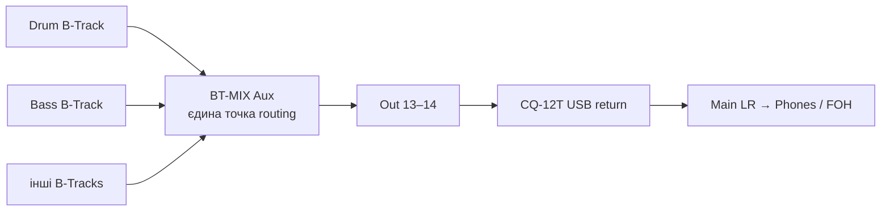
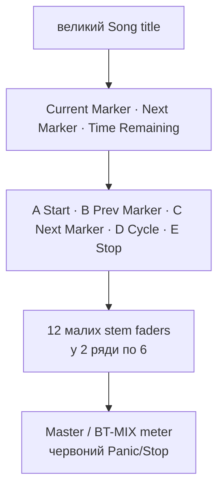
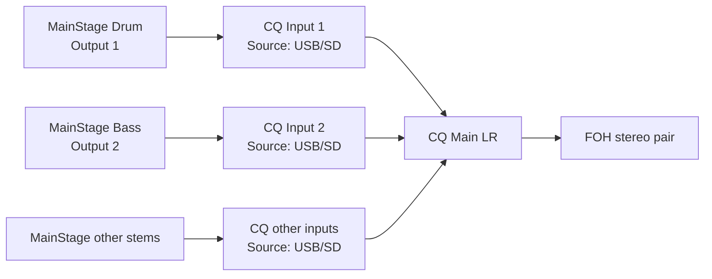
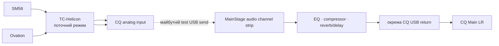
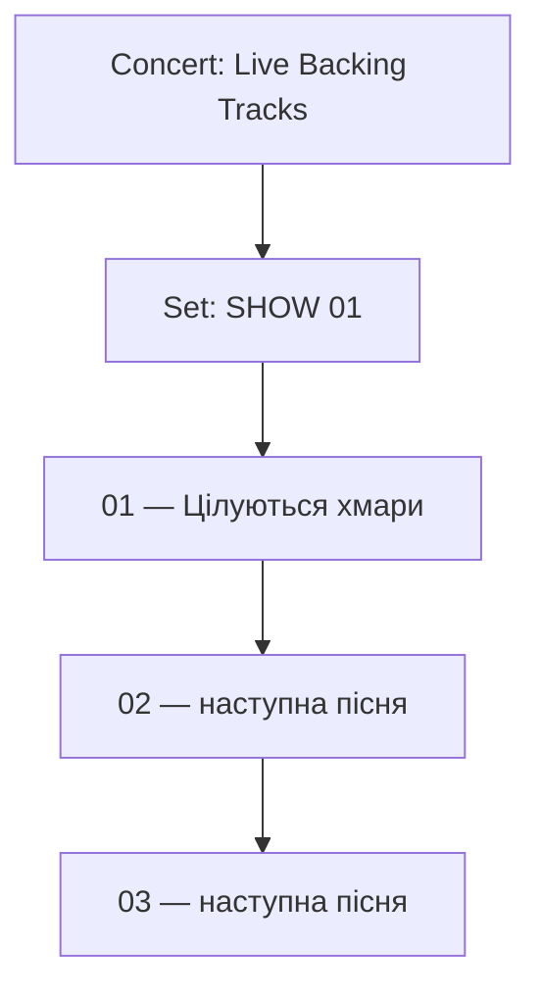

# Advanced MainStage: routing, масштабування, live-входи й керування set list

## Мета цієї сторінки

Це одна узгоджена сторінка для наступного етапу після першого успішного stem-export. Вона відповідає на шість питань:

1. чому `Main` не має окремого hardware `Output` і як мати **одну** точку зміни виходу;
2. як вирости з 8 до 10–12 stems без хаосу;
3. чи можна віддати stems у CQ-12T окремими USB-каналами;
4. як у майбутньому додати живі гітару й вокал у MainStage та міняти їхній звук;
5. як зробити Concert читабельним, повторюваним і безпечним;
6. як додати `Previous Song` / `Next Song` без передчасного переходу на MIDI Program Change.

Цей файл описує **architecture і підготовку**. Він не змінює сьогоднішній робочий Concert, Local Preset 2 AIRSTEP або routing CQ-12T без окремого практичного test.

## Підтверджені вихідні умови

- `Цілуються хмари` уже має 8 exportованих WAV stems.
- Робочий transport: `A = Start`, `B = Previous Marker`, `C = Next Marker`, `D = Cycle`, `E = Stop`.
- Поточний стабільний шлях: усі B-Tracks показують `Output: Main` і через вже успішно перевірений CQ USB path доходять до `Main LR → Phones / FOH`.
- Гітара і SM58 поки проходять через TC-Helicon і CQ-12T, **без** MainStage processing.

## Офіційні джерела

- [Apple MainStage: working at the Concert level](https://help.apple.com/mainstage/mac/2.2/help/English.lproj/en/mainstage/usermanual/chapter_6_section_11.html), перевірено 2026-07-26. Apple пояснює різницю між `Output` і `Master`, а також routing кількох channel strips у Aux.
- [Apple MainStage: channel strips](https://help.apple.com/mainstage/mac/2.2/en/mainstage/usermanual/chapter_5_section_2.html), перевірено 2026-07-26. Описані `Input`, `Output`, Aux, icon/color, `Change All` і ліміти channel strips.
- [Apple MainStage: add a channel strip](https://help.apple.com/mainstage/mac/2.2/help/English.lproj/en/mainstage/usermanual/chapter_4_section_8.html), перевірено 2026-07-26. Підтверджує вибір input/output і mono/stereo формату під час створення audio channel strip.
- [Apple MainStage: Playback in performance](https://help.apple.com/mainstage/mac/2.2/help/English.lproj/en/mainstage/usermanual/chapter_9_section_9.html), перевірено 2026-07-26. Кілька Playback instances можуть синхронно працювати через `Group`; plug-in можна розміщати на patch, set або concert level.
- [Apple MainStage: Playback plug-in](https://help.apple.com/mainstage/mac/2.2/en/mainstage/usermanual/chapter_8_section_1.html), перевірено 2026-07-26. Один instance відтворює один file; він підтримує mono/stereo Playback, waveform і marker display.
- [Apple MainStage: table of actions](https://help.apple.com/mainstage/mac/2.2/help/English.lproj/en/mainstage/usermanual/chapter_D_section_1.html), перевірено 2026-07-26. `Prev Patch` і `Next Patch` — окремі button actions; це не те саме, що MIDI Program Change.
- [Apple MainStage release notes](https://support.apple.com/en-us/101568), перевірено 2026-07-26. У 4.3 додані/покращені Patch List, patch colors, output channel strip colors та output routing.
- [Allen & Heath: CQ multitrack streaming](https://support.allen-heath.com/hc/en-gb/articles/19338440353425-CQ-Multitrack-streaming-using-CQ), перевірено 2026-07-26. Офіційно описує multitrack USB flow DAW → CQ: `Stream Mode = Multitrack`, окремий DAW output на track і `CONFIG > INPUTS > Input Source = USB/SD` для потрібного CQ channel.
- [Allen & Heath CQ User Guide](https://www.allen-heath.com/content/uploads/2023/09/CQ_User_Guide_V1_2_0_iss6.pdf), перевірено 2026-07-26. `USB-B` підтримує `Stereo` або `Multitrack`; multitrack призначений для окремих DAW каналів.

> Інтерфейс у частині Apple Help може візуально відрізнятися від MainStage 4.3. Самі концепції `Aux`, `Output`, `Master`, `Playback Group` і actions підтверджені Apple; перед будь-якою зміною ми звіряємо фактичну назву кнопки у твоєму вікні.

---

## 1. Чому `Main` не має поля `Output`

`Main` у template — це не зручна загальна папка для маршрутизації, а master-level signal flow. Apple описує `Master` як control загальної гучності всього Concert, а окремі `Output` channel strips — як представлення конкретних physical mono/stereo outputs.

Тому відсутність власного `Output` у твоєму `Main` — **нормальна**. Це не помилка й не недоналаштована функція.

### Чому не варто просто залишати всі stems у `Main`

Якщо всі `B-Track` відправлені у `Main`, `Main` керує загальною гучністю, але не є безпечною одною точкою для перемикання USB-пари, яку ти шукаєш. Щоб будь-коли поміняти `Out 13–14` на іншу stereo-пару одним рухом, потрібен не `Main`, а окремий **Aux bus**.

### Рекомендована майбутня схема: `BT-MIX` Aux



Практичний сенс:

- один раз направити кожний B-Track у `BT-MIX`;
- на `BT-MIX` вибрати `Out 13–14`;
- у майбутньому міняти hardware output тільки на `BT-MIX`, а не на 8–12 B-Tracks;
- relative levels stems лишаються такими, як ти їх налаштував; Aux змінює тільки спільну гучність/pan або group-EQ/compression.

Apple прямо підтверджує: коли кілька channel strips відправлено в Aux, їхні relative volume і pan зберігаються, а Aux керує спільним рівнем, pan і може містити EQ/компресію.

### Безпечна дія на завтра

Створимо копію Concert (`File > Save As`) і тільки в ній зробимо `BT-MIX`:

1. Оберемо в `Output` одного B-Track вільний `Bus`.
2. Переконаємося, що в signal flow з’явився Aux.
3. Перейменуємо Aux у `BT-MIX`.
4. Лише на `BT-MIX` задамо `Out 13–14`.
5. Перевіримо один stem, потім усі 8.

Не використовуємо `Change All` у робочому Concert: Apple справді має цю команду, але вона може змінити outputs також тих channel strips, які завтра належатимуть живій гітарі/вокалу.

---

## 2. Якщо stems стане 10–12

Це нормальний масштаб для MainStage. Apple документує значно більші ліміти, але реальна межа для live — не цифра, а стабільність CPU, кількість plug-ins та проста навігація.

### Не змінюй робочий 8-track Concert

Замість цього після `STEM CONCERT: Pass` створи окрему копію:

```text
Backing Tracks — UNIVERSAL 12 STEM.concert
```

Це майбутній reusable template, а не заміна вже перевіреного файлу.

### Рекомендований сталий порядок 12 strips

| Strip | Постійна роль | Якщо у пісні немає цього stem |
| --- | --- | --- |
| 1 | Drums | лишається порожнім |
| 2 | Percussion | порожній |
| 3 | Bass | порожній |
| 4 | Recorded electric guitar | порожній |
| 5 | Piano / Keys | порожній |
| 6 | Organ / Synth | порожній |
| 7 | Other / FX | порожній |
| 8 | Finger Snaps | порожній |
| 9 | Back Vocals | порожній |
| 10 | Extra vocal / choir | порожній |
| 11 | Extra instrument | порожній |
| 12 | Spare / future cue | порожній; не використовувати для click без окремої monitor-схеми |

Один `Playback` instance програє один файл. Для нового strip у копії Concert додай software-instrument channel strip, у `Instrument` вибери `Playback`, а потім `Mono` або `Stereo` відповідно до source WAV. Це підтверджено Apple.

### Layout, який не перевантажує очі

Для 12 stems не треба показувати 12 великих waveform. У `Perform` layout рекомендована ієрархія:



У `Layout` mode Apple дозволяє додавати, копіювати, вирівнювати й групувати screen controls. Для 12 faders зроби один контроль, `Option-drag` першу копію, далі `Edit > Duplicate`, вирівняй та розподіли їх. `Command-Shift-G` групує контролі. Але visual fader не працює сам по собі: у `Edit` mode його треба map до відповідного B-Track `Level`.

Перший advanced layout створимо в копії після того, як 8-stem mix пройде повний test.

---

## 3. Чи можна віддавати stems у CQ-12T окремими USB-каналами?

**Так, технічно можна.** Це не припущення: Allen & Heath офіційно описує multitrack DAW → CQ flow, де кожна DAW track має власний output, а CQ input channel переводиться на `USB/SD`.



### Але це не поточний рекомендований режим

Поточний режим `усі stems → Main` уже працює і дає MainStage повний stem-control. Запланований `BT-MIX → Out 13–14` збереже цю простоту, але додасть одну явну точку для майбутньої зміни hardware output.

Окремі CQ-канали додають можливість робити EQ, compression, FX send і fader кожного stem на самому CQ, але вимагають окремої routing map. Потрібно заздалегідь вирішити:

- який stem mono, а який stereo; stereo stem займає два USB/CQ channels;
- які CQ input channels лишаються фізично для guitar і vocal;
- які USB channels повертають live audio з MainStage, якщо майбутня гітара/вокал оброблятимуться там;
- що саме потрапляє у Main LR та FOH.

Небезпечний сценарій — повернути MainStage на той самий CQ channel, який одночасно використовується як analog live input: це може дати duplicate sound або loop. Тому **не перемикай зараз** `Input Source` існуючих guitar/vocal каналів на `USB/SD`.

### Коли робити multitrack USB routing

Лише після завершення stereo stem Concert і тільки в окремому `CQ MULTITRACK TEST` файлі. Для кожної фізичної зміни в CQ буде окрема таблиця «MainStage output → CQ USB channel → CQ input → Main LR». До неї не переходимо автоматично.

---

## 4. Жива гітара й вокал: що MainStage зможе робити

### Поточний режим: TC-Helicon

Зараз MainStage не змінює звук гітари або вокалу: обробка відбувається у TC-Helicon до CQ-12T. Це стабільний і правильний старт. Не переносимо ці ефекти в MainStage, поки backing stems не будуть повністю перевірені.

### Майбутній MainStage режим

MainStage може взяти live signal на audio channel strip, застосувати EQ, compressor, reverb, delay тощо та зберегти ці settings у patch. Audio strip має hardware `Input` і `Output`; під час створення MainStage попереджає про feedback та ставить audio strip у silence — це навмисний захист.



### Чи можливий інший звук для конкретної частини пісні?

**Так, але не автоматично лише від marker.** Playback marker показує/перемикає audio section; Apple не документує, що він сам запускає зміну guitar/vocal effect.

Є дві правильні моделі:

| Модель | Коли використовувати | Як це працює |
| --- | --- | --- |
| Один live channel strip + ручний MIDI effect switch | Потрібен лише один перехід, наприклад clean → chorus sound | Окрема MIDI button мапиться на bypass/parameter конкретного plug-in. Натискаєш її у заздалегідь позначеному marker місці. |
| Один Set = одна пісня; patches = різні live sounds | Потрібні кілька повних guitar/vocal configurations у пісні | Playback ставиться на set/concert level, тому може продовжувати грати, коли ти вибираєш patch з Clean / Chorus / Solo sound. |

Для твоєї поточної п’яти-кнопкової схеми не забираємо `A–E`: усі п’ять уже мають важливі transport-задачі. Спочатку перевіримо effects MacBook-клавіатурою або екранними controls; лише потім виділимо окрему MIDI-команду без конфлікту.

---

## 5. Практичні advanced tips

### Naming, який відразу читається в MainStage

В Logic використовуй `Custom + Track Name` та такий base name:

```text
01_Tsiluyutsia-khmary__
```

Приклади готових назв:

```text
01_Tsiluyutsia-khmary__01_Drum.wav
01_Tsiluyutsia-khmary__02_Bass.wav
01_Tsiluyutsia-khmary__09_Back-Vocals.wav
```

Переваги: Finder сортує stems музично, а MainStage показує file name у `Playback > File`. Порядковий номер не змінюй, навіть якщо в конкретній пісні певного stem немає.

### Назви, кольори та іконки

- Називай patch: `01 — Цілуються хмари`, а не просто `Song One`.
- Називай channel strips за роллю: `Drum`, `Bass`, `Finger Snaps`, а не `B-Track 1`.
- Вибирай icon/color у `Channel Strip Inspector > Attributes`; Apple прямо описує ці поля.
- Для patch colors у MainStage 4.3 використовуй один колір на весь тип задачі, наприклад жовтий = backing/stems, зелений = safe live processing test. Колір — лише візуальна підказка, не заміна назви.

### Зроби файл читабельним у Perform

Показуй не все, а тільки те, що допомагає на сцені:

- назву пісні;
- `Current Marker`, `Next Marker`, `Time Remaining`;
- waveform із marker names;
- п’ять transport-buttons із реальними назвами A–E;
- meter `BT-MIX` або `Main`;
- потрібні stem faders, але не вікна plug-ins.

Apple окремо підтверджує, що waveform показує markers, а Parameter Text можна map до імені audio file.

### Версії замість ризикованого overwrite

Після кожного успішного test роби `File > Save As`, наприклад:

```text
Backing Tracks — STEM TEST v01.concert
Backing Tracks — STEM TEST v02 BT-MIX.concert
Backing Tracks — UNIVERSAL 12 STEM v01.concert
```

Не редагуй єдиний концерт напередодні виступу.

### Live safety

- Усі індивідуальні stem faders починають із `0.0 dB`; спершу прибирай рівень, а не додавай gain.
- Не додавай важкий plug-in на всі 8–12 strips без rehearsal. Apple попереджає, що resource-intensive plug-ins можуть спричинити dropouts; зі зростанням кількості strips це критично.
- До переходу на MainStage guitar/vocal processing не чіпай current TC-Helicon path.
- `E = Stop` залишається окремою та видимою аварійною дією.

---

## 6. Previous / Next Song і AIRSTEP: правильна модель

Важливе уточнення: **для наступної/попередньої пісні MIDI Program Change не потрібен.** Apple має готові actions:

- `Prev Patch` — обирає patch вище у Patch List;
- `Next Patch` — обирає patch нижче;
- `Prev Set` / `Next Set` — переміщують між групами пісень.

MIDI Program Change потрібен іншим способом: щоб напряму обрати конкретну пісню за її program number (`0–127`). Це корисно пізніше для швидкого переходу до будь-якої з ~25 пісень, але не є базовим Next/Previous mechanism.

### Рекомендована структура set list



Між піснями безпечна послідовність: `E Stop` → `Next Song` або `Previous Song` → перевірити назву patch на екрані → `A Start`.

### Що робимо з AIRSTEP

Поточний Local Preset 2 **не змінюємо**: він уже пройшов `FULL ROUTE`.

Завтра створимо окрему test-копію AIRSTEP profile й спочатку перевіримо `Prev Patch` / `Next Patch` через два екранні button controls. Лише після цього вирішимо, як фізично призначити команди без конфлікту з B/C marker navigation.

Кандидат для test, а не сьогоднішня зміна:

| Жест | Ймовірне призначення | Чому лише test |
| --- | --- | --- |
| короткий B | Previous Marker | уже працює й лишається таким |
| короткий C | Next Marker | уже працює й лишається таким |
| довгий B | Prev Patch | треба окремо перевірити, як AIRSTEP Lite надсилає long-press message у твоєму profile |
| довгий C | Next Patch | те саме |

Не перемикай AIRSTEP Local Preset задньою `Fn` кнопкою під час пісні. Це створює ризик отримати інші CC-команди у момент transport. Прямий MIDI Program Change повернеться тільки після кількох готових patches і окремого test `song number → patch number`.

---

## Завтрашній порядок роботи

1. Підтвердити `STEM CONCERT: Pass` для 8 stems: solo/mute, markers, Cycle, A–E, звук у CQ.
2. У копії Concert створити та протестувати `BT-MIX Aux → Out 13–14`.
3. Створити копію `UNIVERSAL 12 STEM`, але не завантажувати туди випадкові файли.
4. Додати на layout тільки необхідні Perform controls і переконатися, що жоден не перекривається.
5. Протестувати на екрані `Prev Patch`/`Next Patch`; AIRSTEP не змінювати до успішного тесту.
6. Лише потім спланувати окремий, не руйнівний guitar/vocal USB processing test.

## Журнал змін

- 2026-07-26 — створено на запит користувача як одна сторінка для routing, 10–12 stems, multitrack CQ, live guitar/vocal architecture, layout tips і song navigation. Поточна система не змінена.
