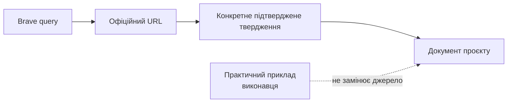

# Журнал зовнішньої перевірки

Цей журнал доводить, що технічні твердження не з’явилися з пам’яті або припущень. Перед новим практичним документом додай запис: дата, конкретний Brave query, офіційні URL, що саме джерело підтверджує, та окремо — неофіційні практичні приклади.

## 2026-07-26 — перевірка стартових документів

### Brave Web Search

**Query:** `site:support.apple.com MainStage 4.3 audio interface preferences Playback plug-in markers`

**Офіційні результати, використані в документації:**

- [MainStage Playback interface](https://support.apple.com/en-bh/guide/mainstage/mstg93cd8d05/mac) — markers у Playback plug-in і функції групового керування.
- [MainStage Playback Sync, Snap To, and Play From parameters](https://support.apple.com/guide/mainstage/mainstage-playback-sync-snap-play-parameters-mstge93aad2f/mac) — поведінка `Current Marker`, `Wait for Marker` і вимоги tempo information для Sync.
- [MainStage release notes](https://support.apple.com/101568) — актуальні виправлення, що стосуються Playback та markers.
- [If MainStage isn't working](https://support.apple.com/en-us/101941) — `MainStage > Preferences > Audio` і вимога сумісності зовнішнього audio/MIDI interface з версією macOS.

### Brave LLM Context

**Query:** `official Allen Heath CQ-12T macOS Tahoe 26 compatibility USB audio Main L R outputs; Zoom AMS-24 output A TRS 48V gain safety; Bose S1 Pro Plus mono line input; Shure SM58 dynamic official manuals`

**Офіційний результат, використаний у документації:**

- [CQ-12T Resources](https://www.allen-heath.com/hardware/cq/cq-12t/resources/) — Allen & Heath не верифікував повну коректну роботу CQ-12T з macOS 26 Tahoe на дату перевірки.

### Brave Web Search

**Query:** `Zoom AMS-24 Operation Manual OUTPUT A TRS impedance balanced 48V gain 0 official`

**Офіційні результати, використані в документації:**

- [Zoom AMS-24 Operation Manual](https://zoomcorp.com/manuals/ams-24-en/) — `Gain = 0` і `48V = OFF` перед підключенням, 48 V для condenser microphones, USB cable із data transfer та виходи `OUTPUT A`.
- [Zoom AMS-24 Operation Manual (PDF)](https://zoomcorp.com/media/documents/E_AMS-24.pdf) — перед підключенням speakers/headphones встановлювати volume в `0`; виходи `L/R` для stereo сигналу.

### Brave Web Search

**Query:** `Bose S1 Pro+ Owner's Guide Channel 3 1/4 TRS line input mono official`

**Офіційні результати, використані в документації:**

- [Bose S1 Pro+ Owner’s Guide](https://assets.bose.com/content/dam/Bose_DAM/Web/consumer_electronics/global/products/speakers/S1PROP-SPEAKERWIRELESS/pdf/872237_og_bose-s1-pro_plus_en.pdf) — 6.35 mm TRS line input у Channel 3 є mono; 3.5 mm AUX input є stereo.

### Brave Web Search

**Query:** `Shure SM58 User Guide dynamic vocal microphone official`

**Офіційні результати, використані в документації:**

- [Shure SM58 User Guide](https://www.shure.com/en-US/docs/guide/SM58) — SM58 є dynamic vocal microphone.

### Brave LLM Context — TC-Helicon routing, ще не завершено

**Query:** `https://mediadl.musictribe.com/download/software/tchelicon/harmony-g-xt-manual-v2.pdf VoiceTone Harmony-G XT manual typical setups output connectors guitar output vocal XLR output`

**Що підтверджено офіційним URL:** повний [VoiceTone Harmony-G XT Product Manual](https://mediadl.musictribe.com/download/software/tchelicon/harmony-g-xt-manual-v2.pdf) існує. Він має бути опрацьований у майбутньому окремому документі до створення фізичної схеми TC-Helicon. До того моменту в документації заборонено припускати, що для базового сетапу потрібні два конкретні кабелі або що гітара й вокал виходять окремо.

## 2026-07-26 — Logic Pro preflight

### Brave Web Search

**Query:** `site:support.apple.com/guide/logicpro Logic Pro 12.3 export project audio files bounce project section cycle mode normalize official`

**Офіційні результати, використані для планування наступного етапу:**

- [Bounce a project to an audio file](https://support.apple.com/guide/logicpro/bounce-a-project-to-an-audio-file-lgcp785a41c3/mac) — `File > Bounce`, Start/End, Cycle mode та normalization; використовується лише в наступному документі про export.
- [Set the bounce range](https://support.apple.com/guide/logicpro/set-the-bounce-range-lgcp190ba9b7/mac) — зв’язок bounce range із Cycle mode та selected regions.

### Brave Web Search

**Query:** `site:support.apple.com/guide/logicpro solo tracks mute tracks Logic Pro Mac`

**Офіційні результати, використані в `10-logic-preflight.md`:**

- [Track header controls](https://support.apple.com/guide/logicpro/track-header-controls-lgcpe19a7a67/mac) — controls у `track header`.
- [Mute tracks](https://support.apple.com/guide/logicpro/mute-tracks-lgcp08bafdee/mac) — `Mute` окремої доріжки.
- [Solo tracks](https://support.apple.com/guide/logicpro/solo-tracks-lgcp58240315/10.7/mac/11.0) — `Solo` для ізольованого прослуховування.

### Brave Web Search

**Query:** `site:support.apple.com/guide/logicpro show tempo track tempo changes Logic Pro`

**Офіційний результат, використаний в `10-logic-preflight.md`:**

- [Tempo track overview](https://support.apple.com/guide/logicpro/tempo-track-overview-lgcpc0ba44af/mac) — показ Global Tracks і Tempo track.

## 2026-07-26 — Logic Pro stereo export і MainStage Playback format

### Brave LLM Context

**Query:** `Apple MainStage User Guide Playback plug-in supported audio file formats WAV AIFF CAF 16-bit 24-bit official`

**Офіційні результати, використані в `11-logic-export-stereo-backing-track.md`:**

- [The Playback Plug-in](https://help.apple.com/mainstage/mac/2.2/en/mainstage/usermanual/chapter_A_section_0.html) — підтримка незжатих mono/stereo AIFF, WAV та CAF із 16/24-bit.
- [Adding a Playback Plug-in](https://help.apple.com/mainstage/mac/2.2/en/mainstage/usermanual/chapter_8_section_1.html) — файли з marker information, зокрема bounced from Logic Pro, можуть використовуватися з Playback.

**Обмеження:** ці офіційні сторінки Apple збереглися в архівному маршруті довідки. Тому кожен exported file додатково проходить import test у встановленому MainStage 4.3 перед концертним використанням.

## 2026-07-26 — уточнення після фінального аудиту

- Виправлено термінологію Zoom: у всіх документах для зовнішнього stereo line output використовується `OUTPUT A L/R`, а не двозначне `Output A/B`.
- Усі згадки про TC-Helicon routing позначено як заплановані до окремої перевірки. До розбору повного офіційного manual і домашнього тесту документація не визначає кількість кабелів, роз’єми або окреме/змішане виведення гітари та вокалу.

## 2026-07-26 — CQ-12T: діагностика помилки sample rate

### Brave LLM Context

**Query:** `Allen Heath CQ-12T USB sample rate 48 96 kHz official user guide and MainStage audio preferences sample rate official Apple`

**Офіційний результат, використаний у документації:**

- [CQ: Multitrack Recording and Playback from SD Card](https://support.allen-heath.com/hc/en-gb/articles/19853352600337-CQ-Multitrack-Recording-and-Playback-from-SD-Card) — Allen & Heath позначає шлях як `CONFIG / Digital Audio (Symbols) / USB/SD`: на фактичному CQ-12T користувача це **піктограма USB, SD і Bluetooth** у `CONFIG`, потім `USB/SD`. Тут обирається `Sample Rate`; CQ-12T підтримує 16×16 USB-аудіо на 48 або 96 kHz. В інструкції не стверджується причина конкретної помилки MainStage, тому в документації це позначено як діагностика, а не встановлений діагноз.

### Brave Web Search

**Query:** `site:support.apple.com Audio MIDI Setup change sample rate audio device Mac`

**Офіційний результат, використаний у документації:**

- [Apple: Set up audio devices in Audio MIDI Setup](https://support.apple.com/guide/audio-midi-setup/set-up-audio-devices-ams59f301fda/mac) — після вибору audio device в sidebar `Format` показує/задає sample rate та bit depth; Apple вимагає відповідності параметрам пристрою.

### Фактичний результат користувача

- CQ-12T: `96 kHz`; MainStage: `96 kHz`; macOS `Audio MIDI Setup`: `96,000 Hz, 16 ch, 24-bit Integer`.
- Після узгодження MainStage з 96 kHz помилка `Sample Rate 48 kHz not allowed` зникла. Імовірне початкове значення MainStage `48 kHz` записано лише як гіпотеза користувача, не як офіційно підтверджена причина.

### Brave Web Search

**Query:** `site:support.apple.com/guide/mainstage "Sample Rate" "Audio Preferences" MainStage`

**Результат:** точного актуального результату Apple Search не повернув. Для кроків MainStage використовуємо лише перевірені екрани встановленого MainStage і не приписуємо Apple непідтверджені назви параметрів.

## 2026-07-26 — Logic Pro: збереження project sample rate під час export

### Brave Web Search

**Query:** `site:support.apple.com/guide/logicpro bounce project sample rate PCM sample rate Logic Pro`

**Офіційні результати, використані в `11-logic-export-stereo-backing-track.md`:**

- [Apple: Set the project sample rate](https://support.apple.com/guide/logicpro/set-the-project-sample-rate-lgcpce0958b8/mac) — не змінювати sample rate після запису або імпорту audio files, щоб уникнути зміни pitch і speed; Logic виконує internal processing і bouncing в original project sample rate.
- [Apple: Bounce a project to an audio file](https://support.apple.com/guide/logicpro/bounce-a-project-to-an-audio-file-lgcp785a41c3/mac) — у bounce потрапляють параметри, effects і automation нем’ючених tracks; `Output 1-2` є типовим stereo output для `File > Bounce`.

## 2026-07-26 — Logic Pro: значення Start/End у Bounce

### Brave Web Search

**Query:** `site:support.apple.com/guide/logicpro bar beat division tick position display start end bounce range`

**Офіційні результати, використані в `11-logic-export-stereo-backing-track.md`:**

- [Apple: Change event position and length](https://support.apple.com/guide/logicpro/change-the-position-and-length-of-events-lgcp215888c6/mac) — музичні позиції мають одиниці bars, beats, divisions і ticks; відлік починається з `1 1 1 1`.
- [Apple: Set the bounce range](https://support.apple.com/guide/logicpro/set-the-bounce-range-lgcp190ba9b7/mac) — без обмежень Bounce охоплює проєкт від Start до End; Cycle mode використовує locator positions, а selected regions обмежують bounce range вибраною ділянкою.

## 2026-07-26 — MainStage: перший import WAV

### Brave Web Search та Brave LLM Context

**Queries:**

- `site:support.apple.com/guide/mainstage create concert set patch MainStage Playback plug-in`
- `site:support.apple.com MainStage add Playback plug-in audio file Playback plug-in`
- `site:support.apple.com/guide/mainstage Playback plug-in "Sync" off audio playback`
- `site:support.apple.com/guide/mainstage MainStage create a new empty concert add patch select patch patch list new concert`

**Офіційні результати, використані в `13-mainstage-concert-foundation.md`:**

- [Apple: Add patches in MainStage](https://support.apple.com/guide/mainstage/add-patches-mstg9da503fa/mac) — `Add Patch` (`+`) у верхньому правому куті Patch List і перейменування patch.
- [Apple: Add a Playback plug-in](https://support.apple.com/nl-nl/guide/mainstage/mstgd241cc7c/mac) — перетягування audio file в Channel Strips створює channel strip із Playback.
- [Apple: MainStage release notes](https://support.apple.com/en-la/101568) — перетягування stereo audio file до mixer створює stereo Playback channel strip.
- [Apple: Playback Sync, Snap To, and Play From](https://support.apple.com/guide/mainstage/mainstage-playback-sync-snap-play-parameters-mstge93aad2f/mac) — `Sync: Off` відтворює audio file в recorded tempo.

## 2026-07-26 — виправлення: MainStage template для першого test Concert

### Brave Web Search та Brave LLM Context

**Queries:**

- `site:support.apple.com/guide/mainstage "8 Backing Tracks" MainStage template`
- `Apple MainStage 4.3 templates "8 Backing Tracks" "Lead Vocal & One Backing Track" official`

**Факти:**

- Точний список template Concerts наданий користувачем із його MainStage 4.3. У ньому **немає** `Empty Concert`; попередня згадка цього template була помилкою і вилучена.
- [Apple MainStage release notes](https://support.apple.com/en-us/101568) офіційно згадують `8 Backing Tracks`, тож його існування підтверджено.
- Офіційні результати пошуку не описують поточний внутрішній routing, Patch List або Channel Strips цього template. До screenshot фактичного Concert документація не припускає його структуру.

### Фактичний screenshot користувача після вибору template

- Template `8 Backing Tracks` у встановленому MainStage 4.3 відкриває `Untitled Concert` з однією Patch `Song One`.
- У центральному mixer видно вісім Playback strips: `Track 1`–`Track 8`; вони виведені до `Main`.
- Цей факт є основою лише для поточного проєкту та версії MainStage користувача. Import-інструкцію оновлено: один stereo backing track завантажується в `Track 1`; інші сім strips не змінюються.

## 2026-07-26 — CQ-12T: діагностика тиші після Playback

### Brave Web Search та Brave LLM Context

**Queries:**

- `site:allen-heath.com/content/uploads CQ User Guide USB B playback USB channel source CQ-12T input channels`
- `site:support.allen-heath.com CQ USB B playback source input channel USB 1 2 Main LR`
- `site:support.apple.com/guide/mainstage Playback plug-in no sound output channel strip main output`
- `https://support.allen-heath.com/hc/en-gb/articles/31464715078929-CQ-USB-B-Routing CQ-12T downstream USB playback inputs 1 2 MainStage`

**Офіційні результати, використані в документації:**

- [Allen & Heath: CQ USB-B Routing](https://support.allen-heath.com/hc/en-gb/articles/31464715078929-CQ-USB-B-Routing) — у CQ-12T USB channels `1` і `2` зі сторони комп’ютера відповідають `Channel 1` і `Channel 2` на mixer.
- [Allen & Heath: CQ Multitrack streaming using CQ](https://support.allen-heath.com/hc/en-gb/articles/19338440353425-CQ-Multitrack-streaming-using-CQ) — для streaming потрібне USB-B з’єднання CQ з комп’ютером; CQ є Core Audio compliant у macOS.
- [CQ-12T Technical Datasheet](https://www.allen-heath.com/content/uploads/2023/10/CQ-12T-Tech-Datasheet.pdf) — USB-B є 16×16 bi-directional audio interface 48/96 kHz, 24-bit.

**Обмеження:** офіційні джерела підтверджують mapping, але не дають достатньо підтверджених даних про фактичний стан сигналу на цьому CQ. Наступна дія — прочитати meters і sources по ланках, а не змінювати налаштування навмання.

### Уточнення напрямків USB routing

- За офіційною статтею [CQ USB-B Routing](https://support.allen-heath.com/hc/en-gb/articles/31464715078929-CQ-USB-B-Routing), `Channel Assignment` у `Config > USB S/D` описує **upstream configurable USB sends**: сигнал, який CQ відправляє до Mac. Тому значення користувача `11/12 → ST IN`, `13/14 → Out 5/6`, `15/16 → Main LR` не налаштовують повернення audio з MainStage у CQ.
- Фактичний meter test: MainStage `Track 1` і `Main` рухаються, CQ не показує сигналу. Це відкидає WAV як причину тиші та вказує на непідтверджений mismatch вихідної USB-пари MainStage / digital input CQ. До перегляду актуального MainStage routing жодна пара не перемикається.

## Важлива примітка про попередні файли

Файли `03-glossary.md`, `05-audio-safety-and-power.md` і `06-cables-and-stage-checklists.md` уже містять прямі офіційні посилання. Їхня джерельна база повторно перевірена через Brave 2026-07-26 цим журналом. До створення наступного документа застосовується обов’язковий research gate з [політики джерел](01-evidence-policy.md#evidence-check).
