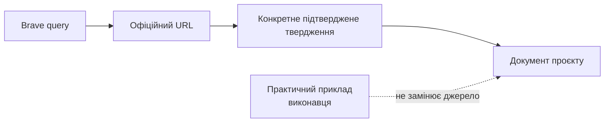

# Журнал зовнішньої перевірки

Цей журнал доводить, що технічні твердження не з’явилися з пам’яті або припущень. Перед новим практичним документом додай запис: дата, конкретний Brave query, офіційні URL, що саме джерело підтверджує, та окремо — неофіційні практичні приклади.

## 2026-07-26 — перевірка стартових документів

### Brave Web Search

**Query:** `site:support.apple.com MainStage 4.3 audio interface preferences Playback plug-in markers`

**Офіційні результати, використані в документації:**

- [MainStage Playback interface](https://support.apple.com/en-bh/guide/mainstage/mstg93cd8d05/mac) — markers у Playback plug-in і функції групового керування.
- [MainStage Playback Sync, Snap To, and Play From parameters](https://support.apple.com/guide/mainstage/mainstage-playback-sync-snap-play-parameters-mstge93aad2f/mac) — поведінка `Current Marker`, `Wait for Marker` і вимоги tempo information для Sync.
- [MainStage release notes](https://support.apple.com/101568) — актуальні виправлення, що стосуються Playback та markers.
- [If MainStage isn't working](https://support.apple.com/en-us/101941) — `MainStage > Preferences > Audio` і вимога сумісності зовнішнього audio/MIDI interface з версією macOS.

### Brave LLM Context

**Query:** `official Allen Heath CQ-12T macOS Tahoe 26 compatibility USB audio Main L R outputs; Zoom AMS-24 output A TRS 48V gain safety; Bose S1 Pro Plus mono line input; Shure SM58 dynamic official manuals`

**Офіційний результат, використаний у документації:**

- [CQ-12T Resources](https://www.allen-heath.com/hardware/cq/cq-12t/resources/) — Allen & Heath не верифікував повну коректну роботу CQ-12T з macOS 26 Tahoe на дату перевірки.

### Brave Web Search

**Query:** `Zoom AMS-24 Operation Manual OUTPUT A TRS impedance balanced 48V gain 0 official`

**Офіційні результати, використані в документації:**

- [Zoom AMS-24 Operation Manual](https://zoomcorp.com/manuals/ams-24-en/) — `Gain = 0` і `48V = OFF` перед підключенням, 48 V для condenser microphones, USB cable із data transfer та виходи `OUTPUT A`.
- [Zoom AMS-24 Operation Manual (PDF)](https://zoomcorp.com/media/documents/E_AMS-24.pdf) — перед підключенням speakers/headphones встановлювати volume в `0`; виходи `L/R` для stereo сигналу.

### Brave Web Search

**Query:** `Bose S1 Pro+ Owner's Guide Channel 3 1/4 TRS line input mono official`

**Офіційні результати, використані в документації:**

- [Bose S1 Pro+ Owner’s Guide](https://assets.bose.com/content/dam/Bose_DAM/Web/consumer_electronics/global/products/speakers/S1PROP-SPEAKERWIRELESS/pdf/872237_og_bose-s1-pro_plus_en.pdf) — 6.35 mm TRS line input у Channel 3 є mono; 3.5 mm AUX input є stereo.

### Brave Web Search

**Query:** `Shure SM58 User Guide dynamic vocal microphone official`

**Офіційні результати, використані в документації:**

- [Shure SM58 User Guide](https://www.shure.com/en-US/docs/guide/SM58) — SM58 є dynamic vocal microphone.

### Brave LLM Context — TC-Helicon routing, ще не завершено

**Query:** `https://mediadl.musictribe.com/download/software/tchelicon/harmony-g-xt-manual-v2.pdf VoiceTone Harmony-G XT manual typical setups output connectors guitar output vocal XLR output`

**Що підтверджено офіційним URL:** повний [VoiceTone Harmony-G XT Product Manual](https://mediadl.musictribe.com/download/software/tchelicon/harmony-g-xt-manual-v2.pdf) існує. Він має бути опрацьований у майбутньому окремому документі до створення фізичної схеми TC-Helicon. До того моменту в документації заборонено припускати, що для базового сетапу потрібні два конкретні кабелі або що гітара й вокал виходять окремо.

## 2026-07-26 — Logic Pro preflight

### Brave Web Search

**Query:** `site:support.apple.com/guide/logicpro Logic Pro 12.3 export project audio files bounce project section cycle mode normalize official`

**Офіційні результати, використані для планування наступного етапу:**

- [Bounce a project to an audio file](https://support.apple.com/guide/logicpro/bounce-a-project-to-an-audio-file-lgcp785a41c3/mac) — `File > Bounce`, Start/End, Cycle mode та normalization; використовується лише в наступному документі про export.
- [Set the bounce range](https://support.apple.com/guide/logicpro/set-the-bounce-range-lgcp190ba9b7/mac) — зв’язок bounce range із Cycle mode та selected regions.

### Brave Web Search

**Query:** `site:support.apple.com/guide/logicpro solo tracks mute tracks Logic Pro Mac`

**Офіційні результати, використані в `10-logic-preflight.md`:**

- [Track header controls](https://support.apple.com/guide/logicpro/track-header-controls-lgcpe19a7a67/mac) — controls у `track header`.
- [Mute tracks](https://support.apple.com/guide/logicpro/mute-tracks-lgcp08bafdee/mac) — `Mute` окремої доріжки.
- [Solo tracks](https://support.apple.com/guide/logicpro/solo-tracks-lgcp58240315/10.7/mac/11.0) — `Solo` для ізольованого прослуховування.

### Brave Web Search

**Query:** `site:support.apple.com/guide/logicpro show tempo track tempo changes Logic Pro`

**Офіційний результат, використаний в `10-logic-preflight.md`:**

- [Tempo track overview](https://support.apple.com/guide/logicpro/tempo-track-overview-lgcpc0ba44af/mac) — показ Global Tracks і Tempo track.

## 2026-07-26 — Logic Pro stereo export і MainStage Playback format

### Brave LLM Context

**Query:** `Apple MainStage User Guide Playback plug-in supported audio file formats WAV AIFF CAF 16-bit 24-bit official`

**Офіційні результати, використані в `11-logic-export-stereo-backing-track.md`:**

- [The Playback Plug-in](https://help.apple.com/mainstage/mac/2.2/en/mainstage/usermanual/chapter_A_section_0.html) — підтримка незжатих mono/stereo AIFF, WAV та CAF із 16/24-bit.
- [Adding a Playback Plug-in](https://help.apple.com/mainstage/mac/2.2/en/mainstage/usermanual/chapter_8_section_1.html) — файли з marker information, зокрема bounced from Logic Pro, можуть використовуватися з Playback.

**Обмеження:** ці офіційні сторінки Apple збереглися в архівному маршруті довідки. Тому кожен exported file додатково проходить import test у встановленому MainStage 4.3 перед концертним використанням.

## 2026-07-26 — уточнення після фінального аудиту

- Виправлено термінологію Zoom: у всіх документах для зовнішнього stereo line output використовується `OUTPUT A L/R`, а не двозначне `Output A/B`.
- Усі згадки про TC-Helicon routing позначено як заплановані до окремої перевірки. До розбору повного офіційного manual і домашнього тесту документація не визначає кількість кабелів, роз’єми або окреме/змішане виведення гітари та вокалу.

## Важлива примітка про попередні файли

Файли `03-glossary.md`, `05-audio-safety-and-power.md` і `06-cables-and-stage-checklists.md` уже містять прямі офіційні посилання. Їхня джерельна база повторно перевірена через Brave 2026-07-26 цим журналом. До створення наступного документа застосовується обов’язковий research gate з [політики джерел](01-evidence-policy.md#evidence-check).
