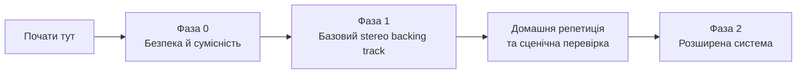

# Concert — Backing Tracks

Ласкаво просимо до української покрокової документації для підготовки й сценічного відтворення backing tracks у **MainStage 4.3** після експорту з **Logic Pro 12.3**.

## З чого почати

1. Прочитайте [Контекст проєкту](00-project-context.md), щоб звірити обладнання, межі базової фази й бажану поведінку на сцені.
2. Відкрийте [Правила доказовості](01-evidence-policy.md): кожен технічний крок у цій документації має підтверджуватися офіційним джерелом.
3. Перейдіть до [Карти документації](02-documentation-map.md), щоб рухатися за фазами без пропуску критичних перевірок.

## Поточний фокус

Базова фаза використовує **один готовий stereo backing track на пісню**. Stems, click, індивідуальний мікс у MainStage і Stage Traxx 4 залишаються окремими наступними темами.

## Навігація

- **Ліва панель** — послідовність документів за фазами.
- **Поле Search** — пошук по всій опублікованій документації.
- **Діаграми Mermaid** — схеми процесів і підключень у відповідних документах; вони рендеряться прямо у браузері.

## Важливо перед сценою

Не змінюйте кабелі за високого рівня гучності. Спершу відкрийте [Безпека, живлення та перша перевірка системи](05-audio-safety-and-power.md) і дотримуйтеся її послідовності.
